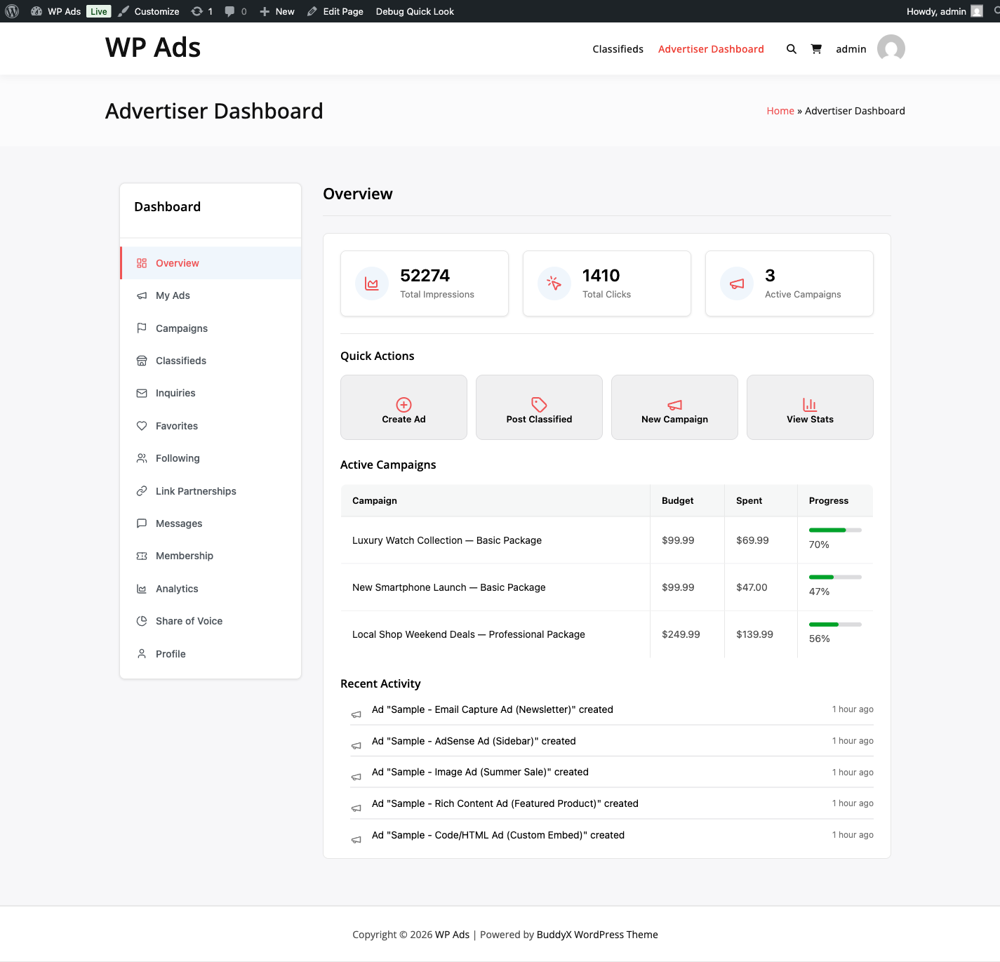
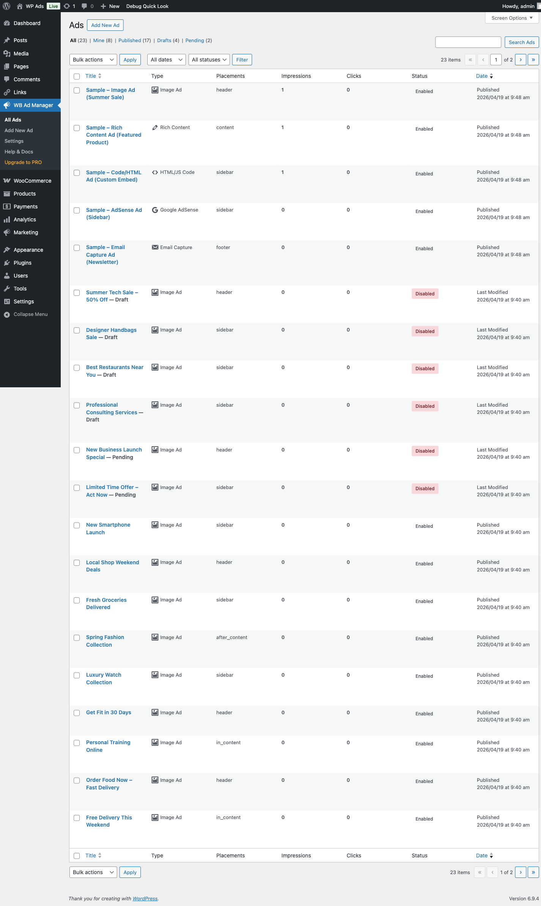
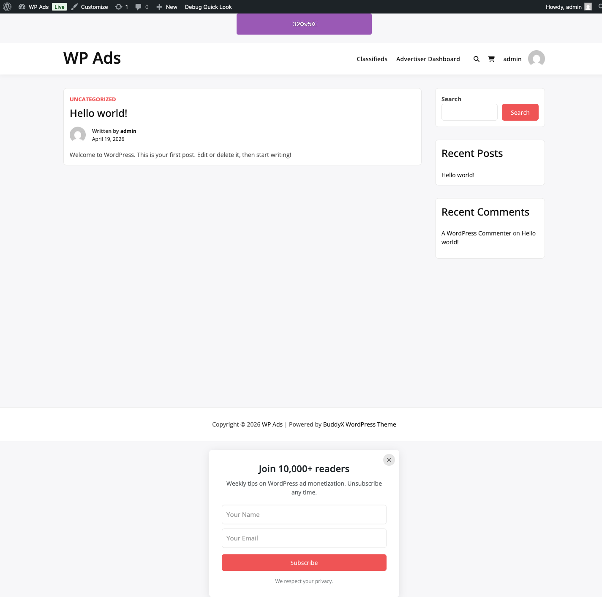

# WB Ad Manager

Complete ad management, affiliate link tracking, and community monetization for WordPress.

- **Product page:** https://store.wbcomdesigns.com/wb-ad-manager
- **Documentation:** https://store.wbcomdesigns.com/wb-ad-manager/docs/

---

## What it does

WB Ad Manager gives you one plugin to handle every part of WordPress monetization: display ads, affiliate links, BuddyPress/bbPress community ads, and — with the Pro add-on — a full classified marketplace and self-service advertiser portal.

Free version is on WordPress.org. Pro is a separate add-on from [wbcomdesigns.com](https://wbcomdesigns.com/downloads/wb-ad-manager-pro/).

---

## Feature Matrix

See [`docs/website/feature-matrix.md`](docs/website/feature-matrix.md) for the full row-by-row comparison. Summary below.

| Capability | Free | Pro |
|------------|------|-----|
| 5 ad types (Image, Rich Content, HTML/JS, AdSense, Email Capture) | ✓ | ✓ |
| 14+ auto-placements (content, popup, sticky, sidebar, archive) | ✓ | ✓ |
| Device, user role, schedule, and post-type targeting | ✓ | ✓ |
| Affiliate link cloaking and click tracking | ✓ | ✓ |
| BuddyPress activity stream and profile ads | ✓ | ✓ |
| bbPress forum topic and reply ads | ✓ | ✓ |
| Basic impressions and clicks dashboard | ✓ | ✓ |
| Classified marketplace (user submissions, paid upgrades) | — | ✓ |
| Advertiser self-service portal | — | ✓ |
| Credit wallet with Wbcom Credits SDK adapters | — | ✓ |
| Campaign management (CPM, CPC, flat-rate) | — | ✓ |
| Advanced analytics with charts and revenue tracking | — | ✓ |
| A/B testing module | — | ✓ |
| Geographic targeting | — | ✓ |
| Priority support | — | ✓ |

---

## Screenshots

**Admin — ads list**

**Advertiser Portal — overview**

**Frontend — live ad**

---

## Why Pro

Pro adds the revenue-generating layer on top of the free plugin. The key architectural decision is the **Wbcom Credits SDK**: Pro does not ship its own Stripe or PayPal integration. Instead, it ships five adapters — WooCommerce Products, WooCommerce Subscriptions, WooCommerce Memberships, Paid Memberships Pro, and MemberPress — that connect the advertiser wallet to whatever payment setup you already run. Any gateway WooCommerce supports (Stripe, PayPal, bank transfer) automatically becomes a wallet top-up path.

See [`docs/website/payments/wallet-and-payments.md`](docs/website/payments/wallet-and-payments.md) for the full configuration guide.

---

## Get Started

Installation guide: [`docs/website/getting-started/installation.md`](docs/website/getting-started/installation.md)

**Five flows to get things running:**

| Flow | Guide |
|------|-------|
| Publish your first ad | [`docs/website/flows/publish-first-ad.md`](docs/website/flows/publish-first-ad.md) |
| Monetize affiliate links | [`docs/website/flows/monetize-affiliate-links.md`](docs/website/flows/monetize-affiliate-links.md) |
| Accept paid ads from advertisers | [`docs/website/flows/accept-paid-ads.md`](docs/website/flows/accept-paid-ads.md) |
| Launch a classifieds marketplace | [`docs/website/flows/launch-classifieds-marketplace.md`](docs/website/flows/launch-classifieds-marketplace.md) |
| Extend via hooks | [`docs/website/flows/extend-via-hooks.md`](docs/website/flows/extend-via-hooks.md) |

---

## Requirements

- WordPress 5.8+
- PHP 7.4+
- Pro add-on requires the free plugin to be installed first (declared via `Requires Plugins` header)
- Pro DB version: `3.8.0` (option `wbam_pro_db_version`)

---

## Repository naming

This repo is `wb-ad-manager` on GitHub but the plugin ships on WordPress.org as `wb-ads-rotator-with-split-test`. The wp.org slug, plugin folder, main file name (`wb-ads-rotator-with-split-test.php`), text domain, and `.pot` filename intentionally stay on the original slug to preserve auto-updates, translation pull from translate.wordpress.org, and existing-install continuity. Only the GitHub URL and the display name ("WB Ad Manager") reflect the rebrand.
