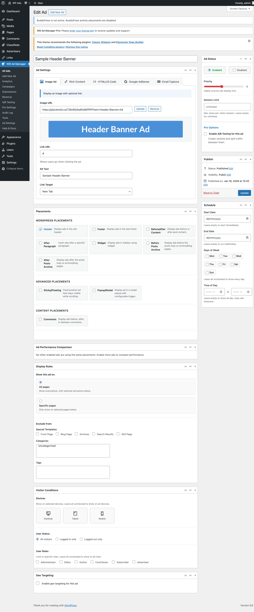
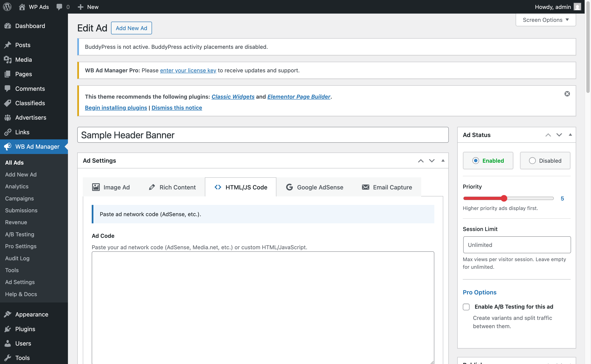

# Ad Types

WB Ad Manager supports five ad types. Choose based on what you're displaying.

---

## Available Ad Types

| Type | Best For | Tracks Clicks |
|------|----------|---------------|
| **Image** | Banners, affiliate graphics | Yes |
| **Rich Content** | Native ads, styled promotions | Yes |
| **Code/HTML/JS** | AdSense, third-party networks, custom scripts | Depends on code |
| **Google AdSense** | Google AdSense specifically | Via AdSense |
| **Email Capture** | Newsletter signups, lead generation | N/A |

---

## Image Ad

Display banner images with click tracking.


*The Image Ad editor showing image upload, destination URL, and alt text fields*

### Settings

| Field | Description |
|-------|-------------|
| **Image** | Upload or select from media library |
| **Destination URL** | Where clicks go |
| **Alt Text** | Image alt attribute (accessibility) |
| **Open in New Tab** | Yes/No |

### Best Practices

- Use standard IAB sizes: 300x250, 728x90, 160x600
- Optimize images for web (compress, proper format)
- Always set alt text for accessibility
- Animated GIFs are supported

---

## Rich Content Ad

Create ads using the WordPress block editor.

### Settings

| Field | Description |
|-------|-------------|
| **Content** | HTML content area (basic HTML tags supported via `wp_kses_post`) |

### Best For

- Native advertising that matches your site's design
- Promotional announcements
- Styled call-to-action boxes
- Content that needs formatting (headings, buttons, lists)

### Tips

- Match your site's design for a native feel
- Keep it concise — it's an ad, not an article
- Use Heading blocks sparingly

---

## Code/HTML/JS Ad

Insert HTML, JavaScript, or third-party ad network code.


*The Code Ad editor showing the syntax-highlighted code input area*

### Settings

| Field | Description |
|-------|-------------|
| **Code** | Your HTML/JavaScript code |

### Common Uses

- Google AdSense manual ad units
- Third-party ad networks (Media.net, etc.)
- Custom tracking pixels
- Affiliate network banner code
- Embedded content

### Security Note

Only use code from trusted sources. Malicious scripts can compromise your site and your visitors.

---

## Google AdSense Ad

Dedicated Google AdSense integration with responsive sizing.

### Settings

| Field | Description |
|-------|-------------|
| **Ad Unit ID** | From your AdSense account |
| **Format** | Auto, Horizontal, Vertical, Rectangle |
| **Responsive** | Enable responsive sizing |

### Setup Steps

1. Log into your [Google AdSense](https://www.google.com/adsense/) account
2. Create an ad unit and copy its Ad Unit ID
3. Go to **WB Ad Manager → Settings → Google AdSense** and enter your Publisher ID
4. Create a new ad in WB Ad Manager, select "AdSense" type
5. Enter your Ad Unit ID, choose format, and save

### Requirements

- Active Google AdSense account
- Site approved by AdSense
- Publisher ID configured in **WB Ad Manager → Settings**

---

## Email Capture Ad

Collect email addresses with a subscription form displayed inline anywhere on your site.

### Settings

| Field | Description |
|-------|-------------|
| **Headline** | Form headline text |
| **Description** | Optional supporting text below the headline |
| **Button Text** | Submit button label (default: "Subscribe") |
| **Show Name Field** | Add an optional name input above the email field |
| **Success Message** | Message shown after successful submission |
| **Redirect URL** | Optional URL to redirect after submission (leave empty to show success message) |
| **Dismiss Duration (Days)** | Days to hide the form after a user closes it. Set 0 to always show. |
| **Privacy Text** | Small privacy notice shown below the form |
| **Background Color** | Form background color picker |
| **Text Color** | Form text color picker |
| **Button Color** | Submit button color picker |

### How It Works

1. A visitor sees the form and submits their email address
2. The plugin stores the submission and fires the `wbam_email_captured` action
3. A success message (or redirect) is shown
4. A cookie is set so the form hides for the configured number of days

### Integrating with Your Email Service

Use the `wbam_email_captured` action hook to pass captured emails to Mailchimp, ConvertKit, or any other service:

```php
add_action( 'wbam_email_captured', function( $email, $name, $ad_id ) {
    // Send to your email service provider.
    // $email  — subscriber email address
    // $name   — subscriber name (empty string if name field is hidden)
    // $ad_id  — WP post ID of the Email Capture ad
}, 10, 3 );
```

### Developer Hooks

| Hook | Type | Description |
|------|------|-------------|
| `wbam_email_form_before` | Action | Fires before the form renders |
| `wbam_email_form_after` | Action | Fires after the form renders |
| `wbam_email_form_before_fields` | Action | Fires before the form fields |
| `wbam_email_form_after_fields` | Action | Fires after fields, before submit (use to add custom fields) |
| `wbam_email_form_after_name` | Action | Fires after name field (if shown) |
| `wbam_email_form_after_email` | Action | Fires after email field |
| `wbam_email_form_data` | Filter | Modify form configuration before render |
| `wbam_email_form_classes` | Filter | Modify wrapper CSS classes |
| `wbam_email_form_button_text` | Filter | Modify button text |
| `wbam_email_form_success_message` | Filter | Modify success message |
| `wbam_email_form_privacy_text` | Filter | Modify privacy text |
| `wbam_email_form_placeholders` | Filter | Modify field placeholder text |
| `wbam_email_form_show_cookie_check` | Filter | Return false to always show form, ignoring dismiss cookie |

### Best Practices

- Offer clear value (newsletter, discount, free resource)
- Keep form fields minimal — email alone converts best
- Test the form after setup
- Comply with GDPR/privacy laws — use the Privacy Text field for your notice

---

## Choosing the Right Type

| Scenario | Recommended Type |
|----------|-----------------|
| Affiliate banner graphic | Image |
| Google AdSense | AdSense |
| Third-party ad network | Code/HTML/JS |
| Custom HTML banner | Code/HTML/JS |
| Promotional announcement | Rich Content |
| Newsletter signup | Email Capture |
| Custom tracking pixel | Code/HTML/JS |
| Native-style promotion | Rich Content |

---

## Related Guides

- [Managing Ads](01-managing-ads.md) - Create and edit ads
- [Placements](04-placements.md) - Where to display ads
- [Targeting](05-targeting.md) - When and to whom
