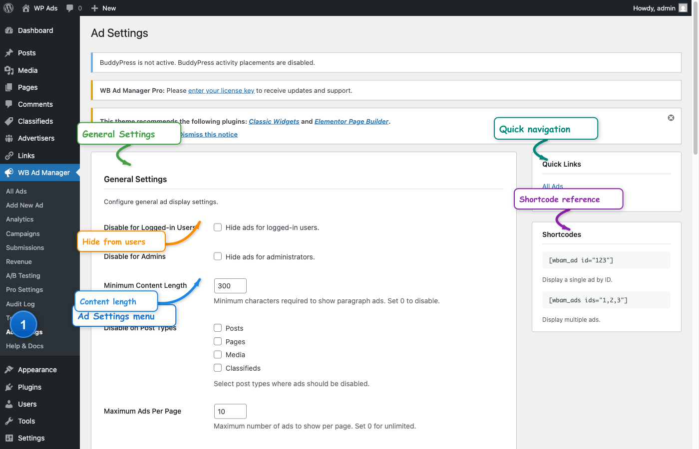

# Settings

Configure WB Ad Manager at **WB Ad Manager → Settings**.


*The settings page with General, Display, Performance, Geo Targeting, AdSense, Privacy, and Advanced sections*

---

## General Settings

| Setting | Description | Default |
|---------|-------------|---------|
| **Disable for Logged-in Users** | Hide all ads from logged-in users | Off |
| **Disable for Admins** | Hide all ads from administrators | Off |
| **Minimum Content Length** | Minimum characters required to show paragraph ads. Set 0 to disable this check. | 300 |
| **Disable on Post Types** | Post types where automatic placements won't show | None |
| **Maximum Ads Per Page** | Limit how many ads display per page. Set 0 for unlimited. | 10 |

### When to Use

- **Disable for Admins**: See your site without ads while testing
- **Disable for Logged-in**: Offer an ad-free experience to members
- **Minimum Content Length**: Prevents paragraph ads from appearing on very short posts
- **Disable on Post Types**: Exclude certain post types from automatic placements entirely
- **Maximum Ads Per Page**: Prevents ad overload on content-heavy pages

---

## Display Settings

| Setting | Description | Default |
|---------|-------------|---------|
| **Ad Label Text** | Optional label shown with ads (e.g., "Advertisement") | Advertisement |
| **Label Position** | Show label above or below the ad | Above |
| **Custom Container Class** | Additional CSS class for ad containers | Empty |

### Ad Label

Adding a label helps with:
- FTC/advertising disclosure compliance
- User transparency
- Ad identification

Leave the label text empty to disable the label entirely.

### Custom Container Class

Add your own CSS class to style ads consistently across your site:
```css
.my-custom-ad-class {
    border: 1px solid #eee;
    padding: 10px;
    margin: 20px 0;
}
```

---

## Performance Settings

| Setting | Description | Default |
|---------|-------------|---------|
| **Lazy Load Ads** | Load ads only when scrolled into view | On |
| **Cache Ad Queries** | Cache database queries using WordPress transients | On |

### Lazy Loading

When enabled, ads below the fold won't load until the user scrolls to them. This improves:
- Initial page load time
- Core Web Vitals scores
- User experience on slow connections

### Cache Ad Queries

Caches ad selection queries to reduce database load. Uses WordPress transients with automatic invalidation when ads change. Recommended for sites with many ads.

---

## Geo Targeting Settings

| Setting | Description | Default |
|---------|-------------|---------|
| **Primary Provider** | Service for IP geolocation | ip-api |
| **ipinfo.io API Key** | API key for ipinfo.io (optional) | Empty |

### Available Providers

| Provider | Requests | API Key Required |
|----------|----------|------------------|
| **ip-api.com** | 45/minute | No |
| **ipinfo.io** | 50K/month | Optional (free tier available) |
| **ipapi.co** | 1K/day | No |

If the primary provider fails, the system automatically tries the next provider.

### Getting an ipinfo.io API Key

1. Go to [ipinfo.io](https://ipinfo.io)
2. Sign up for a free account
3. Copy your API key from the dashboard
4. Paste it into this setting

---

## Google AdSense Settings

| Setting | Description | Default |
|---------|-------------|---------|
| **Publisher ID** | Your AdSense publisher ID (ca-pub-xxx) | Empty |
| **Auto Ads** | Enable AdSense Auto Ads site-wide | Off |

### Getting Your Publisher ID

1. Log into [Google AdSense](https://www.google.com/adsense/)
2. Click your account icon
3. Find "Publisher ID" (starts with `ca-pub-`)
4. Paste it here — this is the default used for all AdSense ads

### Auto Ads

When enabled, Google automatically places ads throughout your site. This works alongside any manually placed ads.

**Note:** Auto Ads may place ads in locations you don't control. Test thoroughly before enabling on production.

---

## Privacy & GDPR Settings

| Setting | Description | Default |
|---------|-------------|---------|
| **Require Consent for AdSense** | Only load AdSense after user consent | Off |
| **Anonymize IP Addresses** | Store hashed IPs instead of raw addresses | On |

### Consent for AdSense

When enabled, AdSense scripts won't load until the user gives consent. Works with popular consent plugins:
- Cookie Notice
- CookieYes
- Complianz
- GDPR Cookie Consent
- Other plugins that implement standard WordPress consent APIs

### IP Anonymization

When enabled, IP addresses are hashed before storage, making them non-identifiable. This helps with:
- GDPR compliance
- Privacy protection
- Reduced data liability

Recommended to keep this On for sites with EU visitors.

---

## Advanced Settings

| Setting | Description | Default |
|---------|-------------|---------|
| **Delete Data on Uninstall** | Remove all plugin data when uninstalling | Off |

### Delete Data on Uninstall

When enabled, uninstalling the plugin will permanently delete:
- All ads and ad data
- All tracked links
- All statistics and analytics
- All plugin settings

**Warning:** This cannot be undone. Only enable if you are certain you want complete removal.

---

## Performance Tips

### For Speed

- Enable lazy loading for ads below the fold
- Enable ad query caching
- Disable unused modules
- Optimize images before uploading to media library

### For Accuracy

- Exclude bots from tracking (handled automatically)
- Enable "Disable for Admins" to keep your own views out of stats

### For Privacy

- Enable IP anonymization
- Require consent for AdSense if targeting EU visitors
- Review the Delete Data on Uninstall option before removing the plugin

---

## Related Guides

- [Targeting](05-targeting.md) - Per-ad targeting options
- [Placements](04-placements.md) - Available placement locations
