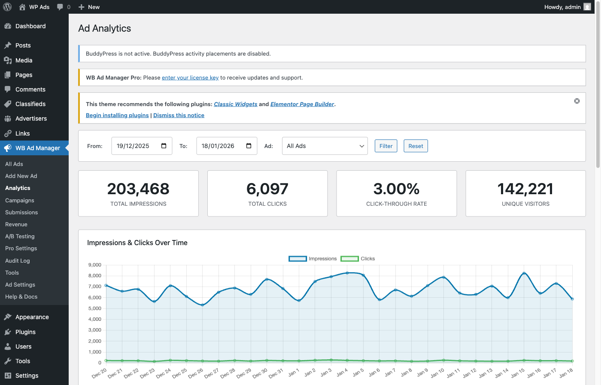

# Managing Ads - Site Owner Guide

## What You'll Learn

- How to create different ad types
- How to assign placements directly on each ad
- How to set priority and session limits
- Best practices for ad management

---

## How Ad Placement Works

Ads do not use zones. Instead, each ad has its own **Placements** metabox where you check which locations it should appear in (header, footer, after content, sidebar, etc.).

When multiple ads share the same placement, they rotate automatically. Priority controls how often each ad is shown — higher priority ads appear more often.

---

## Creating Ads

### Step-by-Step

1. Go to **WB Ad Manager → Ads**
2. Click **Add New**
3. Enter the ad title (internal reference only)
4. Choose an ad type and fill in the content
5. In the **Placements** metabox, check all locations where the ad should appear
6. In the **Ad Status** metabox, set priority and optional session limit
7. Click **Publish**

### Ad Types

#### Image Ads

Best for: Banners, promotional graphics, affiliate images

**Required fields:**
- Image upload (JPG, PNG, GIF, WebP)
- Destination URL
- Alt text (for accessibility)

**Tips:**
- Optimize images before upload to keep page load fast
- Animated GIFs are supported
- Use standard IAB sizes: 300x250, 728x90, 160x600

#### Rich Content Ads

Best for: Native advertising, styled announcements, promotional content

**Fields:**
- HTML content area (supports basic HTML tags via `wp_kses_post`)

**Tips:**
- Match your site's design for a native feel
- Keep content concise — it's an ad, not an article

#### Code/HTML/JS Ads

Best for: Third-party ad networks, custom scripts, embedded content

**Fields:**
- HTML/JavaScript code input

**Tips:**
- Test code before saving
- Use for affiliate network banners, custom tracking pixels
- Check mobile compatibility

#### Google AdSense

Best for: Google AdSense integration with responsive sizing

**Fields:**
- Ad Unit ID (from your AdSense account)
- Format (Auto, Horizontal, Vertical, Rectangle)
- Responsive sizing toggle

**Requirements:**
- Active Google AdSense account approved for your site
- Publisher ID configured in **WB Ad Manager → Settings → Google AdSense**

#### Email Capture

Best for: Newsletter signups, lead generation

See [Ad Types](ad-types.md) for full Email Capture documentation.

---

## Ad Scheduling

### Setting Date Ranges

When creating or editing an ad:

1. Find the **Schedule** section
2. Set **Start Date** — when the ad becomes active
3. Set **End Date** — when the ad expires (optional)
4. Save changes

### Schedule Examples

| Scenario | Start Date | End Date |
|----------|------------|----------|
| Always active | Leave empty | Leave empty |
| Future launch | Dec 25, 2024 | Leave empty |
| Limited time | Dec 1, 2024 | Dec 31, 2024 |
| One day | Dec 25, 2024 | Dec 25, 2024 |

---

## Ad Priority

Control how often an ad appears relative to others sharing the same placement.

### Setting Priority

1. Edit the ad
2. Find the **Ad Status** metabox (right sidebar)
3. Drag the **Priority** slider — range is 1 to 10
4. Save

Higher priority = shown more often when multiple ads share a placement.

### Priority Examples

| Ad | Priority | Effect |
|----|----------|--------|
| Featured sponsor | 10 | Shown most often |
| Regular sponsor | 5 | Shown at medium frequency |
| House ad | 1 | Shown least often |

---

## Session Impression Limit

Limit how many times a single visitor sees an ad per session.

### Setting the Limit

1. Edit the ad
2. Find the **Ad Status** metabox
3. Enter a number in **Session Limit**
4. Leave empty for unlimited

| Value | Behavior |
|-------|----------|
| Empty | Unlimited — no cap |
| 1 | Show once per visitor session |
| 3 | Show up to 3 times per session |

---

## Managing Placements

Each ad shows a **Placements** metabox listing all available locations grouped by type. Check the boxes for where this ad should appear.

### Automatic Placements

When you check an automatic placement (header, footer, after content, etc.), the ad appears there without any shortcode.

### Shortcode Placement

To display a specific ad manually using a shortcode:

```
[wbam_ad id="123"]
```

See [Shortcode Reference](../shortcode-reference/ad-shortcodes.md) for all shortcode options.

### Via PHP (Theme)

```php
<?php echo do_shortcode( '[wbam_ad id="123"]' ); ?>
```

---

## Tracking Performance

### Viewing Stats


*The ads list showing impressions, clicks, and status columns per ad*

The Ads list shows impressions and clicks directly in the table columns. For per-ad details:

1. Edit any ad
2. If other active ads share the same placement, a **Ad Performance Comparison** metabox appears
3. View side-by-side CTR comparison with a visual bar chart
4. A "Winner" badge marks the ad with the highest CTR (requires 100+ impressions)

### Key Metrics

| Metric | What It Means | Good Target |
|--------|---------------|-------------|
| **Impressions** | Times ad was shown | Varies |
| **Clicks** | Times ad was clicked | More is better |
| **CTR** | Clicks ÷ Impressions | 0.5%+ |

---

## Organizing Ads

### Using Categories

Create categories to organize ads:

1. Go to **WB Ad Manager → Ads → Categories**
2. Add categories (e.g., "Sponsors", "House Ads")
3. Assign ads to categories when editing

### Best Practices

- Use consistent naming conventions
- Create categories by advertiser or campaign
- Archive old ads instead of deleting
- Use tags for additional organization

---

## Bulk Operations

### Bulk Edit Ads

1. Go to **WB Ad Manager → Ads**
2. Check multiple ads
3. Select a bulk action (Move to Trash, Edit)
4. Click Apply

### Export/Import

- Export: Use WordPress export (Tools → Export)
- Import: Use WordPress import (Tools → Import)

---

## Best Practices

### Ad Placement Effectiveness

| Location | Effectiveness | Notes |
|----------|---------------|-------|
| Above fold | High | Seen immediately |
| In-content | High | Read alongside content |
| Sidebar | Medium | Always visible |
| Footer | Low | Often missed |

### Performance Tips

1. **A/B test** — Create variations and use the comparison metabox
2. **Rotate regularly** — Add multiple ads per placement to prevent ad blindness
3. **Match context** — Relevant ads perform better
4. **Optimize images** — Compress before uploading for faster load times
5. **Monitor CTR** — Disable underperformers directly from the comparison table

### Common Mistakes

- Too many ads per page (3–5 is ideal)
- Ads that don't match the surrounding content
- Slow-loading ad images
- Ignoring mobile users
- Not tracking performance

---

## Next Steps

- [Set up link management](../link-management/link-management.md)
- [View all shortcodes](../shortcode-reference/ad-shortcodes.md)
- [Troubleshooting](../troubleshooting/common-issues.md)

---

*Upgrade to WB Ad Manager Pro for campaigns, wallet payments, classifieds, and analytics.*
