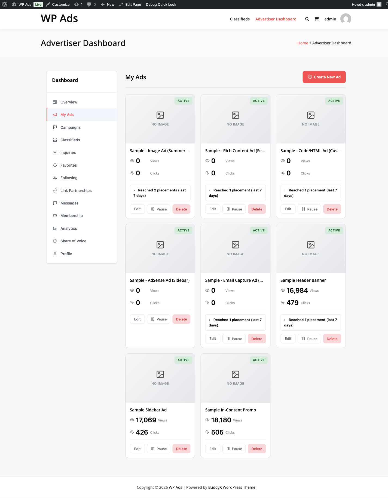

# Ad Submissions and Approval Workflow



> **PRO feature.** Requires the [WB Ad Manager Pro](https://wbcomdesigns.com/downloads/wb-ad-manager-pro/) add-on on top of the free plugin.

When an advertiser submits an ad, the plugin creates the ad, links it to a campaign, handles wallet charges, and routes it through your approval workflow. This guide explains each step for both admins and advertisers.

## How Submission Works

Advertisers submit ads from the Advertiser Dashboard (the `[wbam_submit_ad]` shortcode redirects there automatically). The submission process runs in this order:

1. The advertiser's account is validated and the selected package is checked
2. The wallet balance is checked against the required amount for the package
3. The ad post is created in draft status
4. A campaign is created via `Campaign_Manager::create_from_package()` using the package's pricing model, budget, and duration
5. The submission record is saved linking the ad, campaign, and package
6. For flat-rate packages, the package price is debited from the wallet immediately
7. For packages that do not require approval, the campaign activates at once — this triggers budget reservation for CPM/CPC packages
8. For packages that require approval, the submission enters pending status and you receive a notification

If any step fails (balance check, campaign creation, wallet charge), the entire submission is rolled back: the ad post and campaign are deleted and the advertiser sees an error message.

## Submission Statuses

| Status | Meaning |
|--------|---------|
| **Pending** | Submitted and waiting for your review |
| **Approved** | Ad is live and campaign is active |
| **Rejected** | Ad was declined. For flat-rate packages, the package price is automatically refunded to the advertiser's wallet. |
| **Changes Requested** | Returned to the advertiser for edits. Advertiser can update and resubmit. |
| **Cancelled** | Submission was withdrawn |

## Reviewing Submissions

Go to **WB Ads > Submissions** to see all submissions.

Each submission shows:

- Ad preview (image, code, or rich content)
- Advertiser name and email
- Package selected
- Requested placements
- Submission date

**Available actions:**

| Action | What Happens |
|--------|-------------|
| **Approve** | Campaign activates (triggers budget reservation for CPM/CPC). Ad is published. Advertiser is notified. |
| **Reject** | Submission is declined. Flat-rate package fees are automatically refunded. Advertiser is notified with your reason. |
| **Request Changes** | Submission is returned to the advertiser. They can edit and resubmit. |

**Bulk actions:** Select multiple submissions to approve or reject them all at once.

## Approval on Activation

When you approve a submission, the plugin first activates the campaign. If campaign activation fails — for example because a CPM/CPC campaign cannot reserve its budget due to insufficient wallet balance — the approval is rolled back, the submission stays in its previous status, and you see an error. The advertiser needs to top up their wallet before you can successfully approve.

## Auto-Approval

Submissions can be approved automatically without manual review in two cases:

1. **Package setting** — The package has "Requires Approval" turned off. The ad goes live immediately on submission.
2. **Trust system** — If you have enabled the trust system in settings, trusted advertisers with paid submissions can be auto-approved. Code and HTML ad types always require manual review regardless of trust level (for security).

Configure auto-approval settings at **WB Ad Manager Pro > Settings > General** (Trust System section).

## The Shortcode

```
[wbam_submit_ad]
```

Place this shortcode on any page. It redirects visitors to the Advertiser Dashboard ad submission form. The standalone wizard is no longer used — all submission happens inside the dashboard.

## Action Hooks for Developers

The submission system fires action hooks at each key moment so you can add custom behavior.

| Hook | When It Fires | Parameters |
|------|--------------|------------|
| [`wbam_ad_submitted`](../../pro-developer/HOOKS.md#ad-submissions) | After a submission is created | `$submission` object |
| `wbam_ad_submission_approved` | After an admin approves a submission | `$submission` object |
| `wbam_ad_submission_rejected` | After an admin rejects a submission | `$submission` object, `$reason` string |
| `wbam_ad_submission_changes_requested` | After changes are requested | `$submission` object, `$notes` string |
| `wbam_ad_submission_resubmitted` | After an advertiser resubmits after changes | `$submission` object |
| `wbam_fund_request_submitted` | When a manual payment fund request is submitted | `$transaction_id`, `$advertiser`, `$amount` |

## Ad Types Supported

Advertisers can submit three types of ads:

| Ad Type | Required Fields |
|---------|----------------|
| **Image** | Image upload or URL, alt text, destination URL |
| **Code** | HTML or JavaScript ad code |
| **Rich** | Rich text content (filtered with `wp_kses_post`) |

Code and HTML ads always enter pending review regardless of auto-approval rules.
