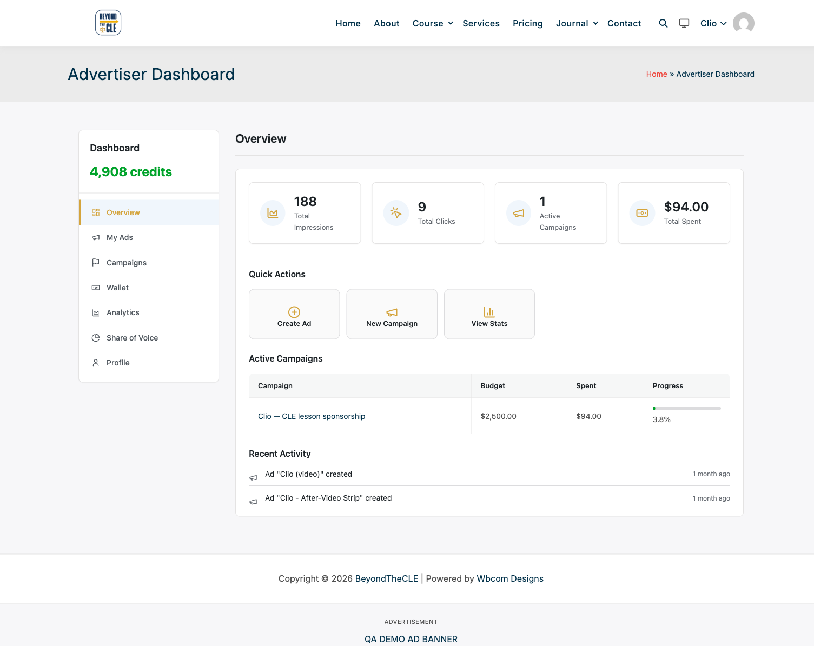
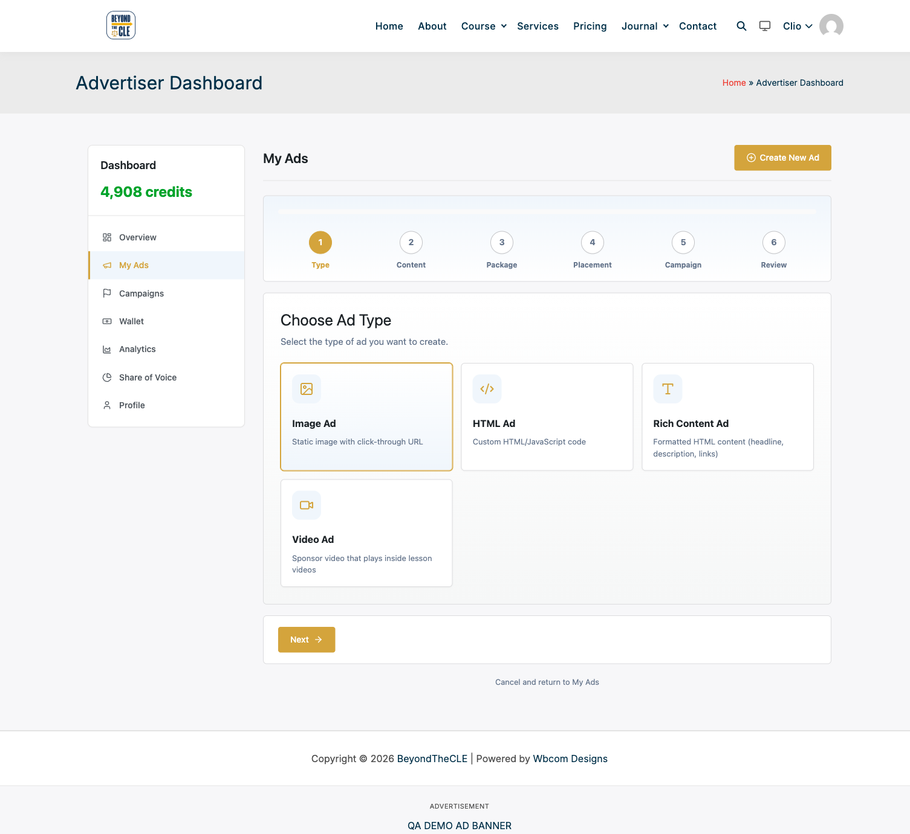
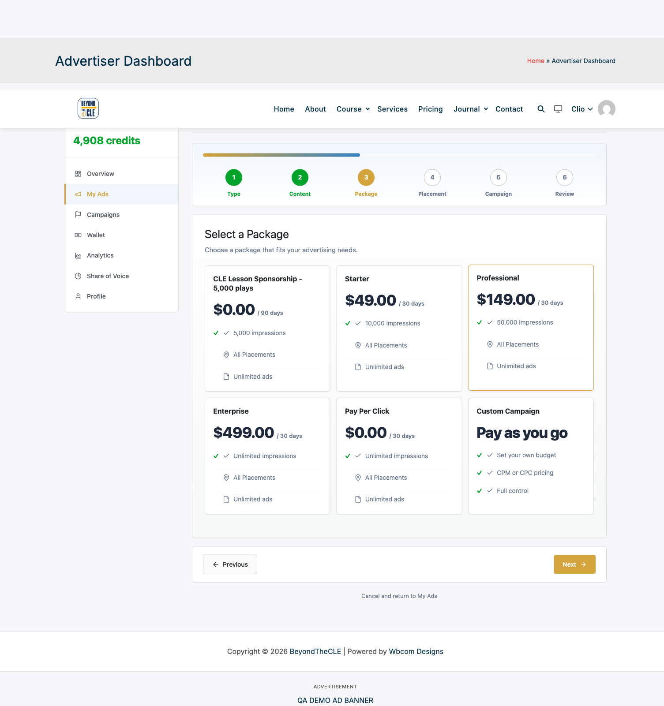
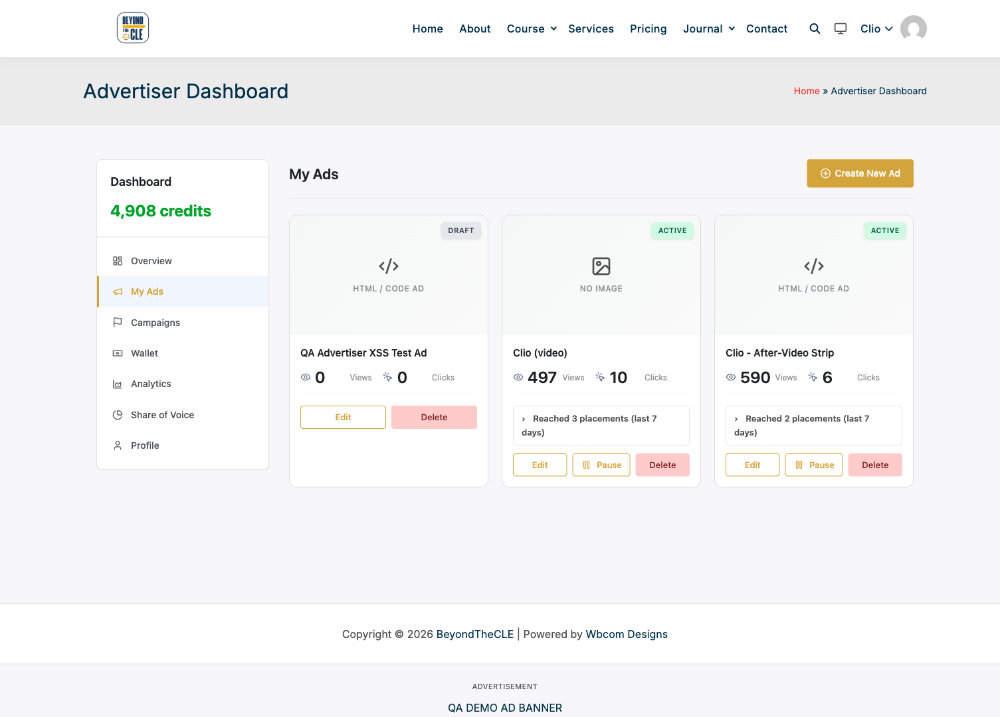
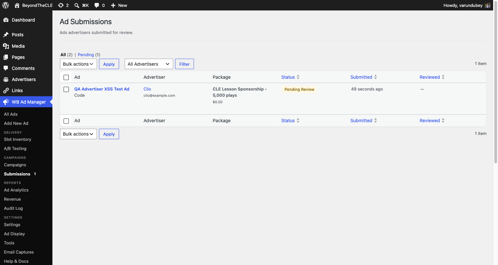

# From signup to a live ad

This is the end-to-end path an advertiser takes on your site, and what you do as
the site owner at each hand-off point.

---

## 1. Getting portal access

Advertisers reach the portal through the page holding the
`[wbam_advertiser_dashboard]` shortcode (commonly `/advertiser-dashboard/`).

An advertiser record is created for a WordPress user the first time they use the
portal, or when you create one from **Advertisers → Add New** in wp-admin.

> **Allowing self-signup:** the portal uses WordPress accounts, so new advertisers
> can only register themselves if **Settings → General → Anyone can register** is
> enabled. If you keep registration closed, create the WordPress user (or the
> advertiser record) yourself and send them their login.

**Advertisers never need wp-admin.** When someone whose only role is advertiser
opens a wp-admin URL, they are sent to the portal dashboard instead, and the
admin bar stays hidden.

---

## 2. The portal dashboard

After logging in the advertiser lands on their overview: credit balance,
lifetime impressions and clicks, active campaigns with budget progress, quick
actions, and recent activity.

*The advertiser's overview. The sidebar carries My Ads, Campaigns, Wallet, Analytics, Share of Voice and Profile.*

---

## 3. Creating an ad

**My Ads → Create New Ad** opens a six-step wizard: Type, Content, Package,
Placement, Campaign, Review.

### Step 1 — Choose the ad type

*Image, HTML, Rich Content, and Video ads. Video ads play inside lesson videos.*

### Step 2 — Content

The advertiser names the ad (internal reference) and supplies the creative:
image URL and click-through for image ads, markup for HTML ads, headline and
body for rich content, or the video source for video ads.

> **HTML ads are sanitized.** Unless the submitter is an administrator with the
> `unfiltered_html` capability, `<script>` tags and inline event handlers such as
> `onerror` are stripped on save, and the preview renders inside a sandboxed
> frame. Advertisers cannot inject executable code into your pages.

### Step 3 — Pick a package

*Packages you publish, each with its impression allowance, duration, placements and price. "Custom" lets the advertiser request something outside your packages.*

### Steps 4 to 6 — Placement, campaign, review

The advertiser chooses where the ad should run, attaches it to a new or existing
campaign, then reviews everything. Submitting requires agreeing to your terms.

---

## 4. After submitting

The ad is saved as a **draft** and enters your review queue. It does not serve
until you approve it. The advertiser sees it in My Ads marked DRAFT, next to
their live ads and their real view and click counts.

*The submitted ad waits as a draft. Active ads show views, clicks, and how many placements they reached in the last 7 days.*

---

## 5. Reviewing it as the site owner

**WB Ad Manager → Submissions** lists everything waiting, with a count badge on
the menu. Each row shows the ad, the advertiser, the package they picked, and how
long it has been waiting.

*The review queue. Approving publishes the ad and starts it serving; rejecting returns it to the advertiser with your note.*

Approving the submission publishes the ad and enables it, so it begins serving
in its assigned placements immediately. There is no second step to remember.

---

## Related guides

- [Advertiser portal overview](advertiser-portal-overview.md) — every portal tab explained
- [Ad submissions and approval workflow](ad-submissions-approval-workflow.md) — review, reject, and notification detail
- [Campaign management](campaign-management.md) — budgets, scheduling, and pacing
