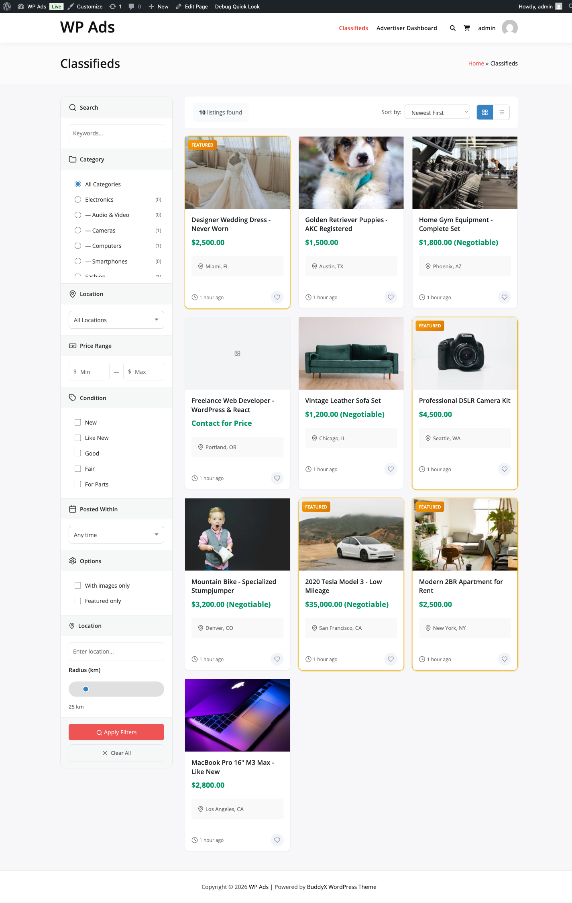

# Setting Up Classifieds

> **PRO feature.** Requires the [WB Ad Manager Pro](https://wbcomdesigns.com/downloads/wb-ad-manager-pro/) add-on on top of the free plugin.

The Classifieds module adds a full peer-to-peer marketplace to your WordPress site. Sellers submit listings, buyers browse and send inquiries, and you manage everything from the WordPress admin.

> **Requires:** Classifieds module enabled in WB Ad Manager Pro → Settings → Modules

---

## Enabling the Module

1. Go to **WB Ad Manager Pro → Settings → Modules**
2. Toggle **Classifieds** to enabled
3. Save settings

Once enabled, the plugin registers the `wbam-classified` custom post type with two taxonomies: **Categories** (`wbam-classified-cat`) and **Locations** (`wbam-classified-loc`).

---

## Creating Required Pages

Create pages for each shortcode you want to use and publish them. At minimum you need a browse page and a submission page.

| Page | Shortcode |
|------|-----------|
| Browse Classifieds | `[wbam_browse_classifieds]` |
| Submit a Listing | `[wbam_submit_classified]` |
| My Listings | `[wbam_my_classifieds]` |
| My Favorites | `[wbam_my_favorites]` |
| Sellers I Follow | `[wbam_my_following]` |
| Search | `[wbam_classified_search]` |

---

## Shortcode Reference

### `[wbam_submit_classified]`

Displays the multi-step classified submission form. Requires the user to be logged in and to have an approved advertiser account. The submit form template (`templates/classifieds/submit-form.php`) can be copied to your theme folder at `your-theme/wbam/classifieds/submit-form.php` for full customization without plugin updates overwriting your changes.

### `[wbam_my_classifieds]`

Shows the logged-in advertiser's own listings with options to edit, renew, or delete each one.

### `[wbam_browse_classifieds]`

Displays the public listing grid with sidebar category and location filters, price range filtering, and sort options (newest, price low-to-high, price high-to-low, featured first). Supports AJAX-powered filtering without page reloads.

### `[wbam_classified_search]`

Renders a standalone search form that submits to the browse page. Use this in sidebars or headers.

### `[wbam_my_favorites]`

Shows all listings the logged-in user has saved as favorites.

### `[wbam_my_following]`

Shows all sellers the logged-in user is following. New listings from followed sellers appear in this feed.

---

## Listing Types

Each classified is assigned a listing type when submitted. The type controls placement and billing behavior.

| Type | Description |
|------|-------------|
| `standard` | Default free or paid listing |
| `featured` | Pinned to top of search results with featured badge; recurring monthly billing from wallet |
| `premium` | Highest-visibility tier; same billing behavior as featured |

Listing type is stored in the `wbam_classifieds` database table and cannot be changed by the seller after submission without going through the upgrade flow.

---

## Listing Upgrades

Sellers can upgrade a live listing from their advertiser portal. Prices are set in **WB Ad Manager Pro → Settings → Classifieds** (Upgrade Options section).

| Upgrade | Default Price | Default Duration | Effect |
|---------|--------------|-----------------|--------|
| Featured | $5.00 | 30 days | Pinned to top of results |
| Highlighted | $3.00 | 7 days | Colored highlight border |
| Urgent | $4.00 | 7 days | "Urgent" badge on card |
| Bump | $2.00 | 7 days | Refreshes listing date to now |
| Top | $10.00 | 30 days | Shown in "Top Listings" section |

All upgrade costs are deducted from the advertiser's wallet balance at the time of purchase. Featured and premium upgrades renew automatically each month. If the wallet balance is insufficient at renewal, the listing is downgraded to standard and the advertiser receives an email notification.

---

## Expiration and Renewal

Standard listings expire after the duration set in **Settings → Classifieds → Listing Duration** (default: 30 days). Featured listings expire based on the featured billing cycle.

**Automatic expiration flow:**

1. A daily cron job checks for expired listings (`wbam_pro_daily_cleanup`)
2. Listings past their `expires_at` date are set to `expired` status
3. Expiration warning emails are sent 3 days before expiry (configurable)
4. Sellers renew from their **My Classifieds** dashboard tab

**Featured billing flow (hourly cron):**

1. The `wbam_process_classified_billing` cron runs hourly
2. Featured/premium listings with `featured_next_billing <= NOW()` are processed
3. The wallet is debited for the configured monthly fee
4. On success: `featured_next_billing` advances by one month, confirmation email sent
5. On failure (insufficient funds): listing downgraded to standard, downgrade email sent

---

## Inquiry System

Visitors can contact sellers without revealing the seller's email address. The inquiry form appears on each single classified page.

**How it works:**

- Buyer submits name, email, phone (optional), and message via the contact form (`templates/classifieds/contact-form.php`)
- Both logged-in and guest users can send inquiries
- Inquiry is stored in the `wbam_classified_inquiries` table with status `unread`
- Seller receives an email notification
- Seller manages all inquiries from their portal **Inquiries** tab
- Inquiry statuses: `unread`, `read`, `replied`, `archived`

---

## Report System

Any visitor can report a listing as inappropriate. Reports go to the WordPress admin for review.

**Report workflow:**

1. Visitor clicks "Report" on a single listing page
2. Selects a reason and adds optional details
3. Report is stored in `wbam_classified_reports` with status `pending`
4. Admin reviews reports under **WB Ad Manager Pro → Classifieds → Reports**
5. Admin can mark reports as `reviewed`, `resolved`, or `dismissed`

---

## Favorites and Follow Seller

Logged-in users can save listings and follow sellers.

- **Favorites:** Click the heart icon on any listing to save it. View saved listings via `[wbam_my_favorites]`
- **Follow Seller:** Click "Follow" on a seller's profile page. View followed sellers and their new listings via `[wbam_my_following]`

Both features require the user to be logged in. Guest users see a login prompt.

---

## BuddyPress xProfile Seller Fields

When BuddyPress is active and the BuddyPress module is enabled, you can map xProfile fields to appear on seller profile pages. This lets you surface verified member data (business name, location, rating) directly on classified listings.

**To configure:**

1. Go to **WB Ad Manager Pro → Settings → BuddyPress**
2. Enable **xProfile Field Mapping**
3. Add field mappings: select the xProfile field ID, set a display label, and choose an icon
4. Save settings

Mapped fields appear automatically on single classified pages and on the public seller profile page (`/seller/{slug}/`). Fields with empty values for a given user are hidden automatically. Multi-select xProfile fields are joined with a comma.

---

## Custom Field Storage (wbam_classified_meta)

Since DB version 2.8.0, classified custom fields are stored in the dedicated `wbam_classified_meta` table instead of WordPress post meta. This provides better query performance and cleaner data separation.

**Table:** `{prefix}wbam_classified_meta`

The CRUD API mirrors WordPress core meta functions:

| Method | Equivalent WP Function |
|--------|----------------------|
| `Classified::add_meta( $key, $value )` | `add_post_meta()` |
| `Classified::get_meta( $key, $single )` | `get_post_meta()` |
| `Classified::update_meta( $key, $value )` | `update_post_meta()` |
| `Classified::delete_meta( $key )` | `delete_post_meta()` |

Meta rows are automatically deleted when a classified is deleted, either through `Classified::delete()` or through the cascade delete triggered in the admin.

---

## Template Files

You can override any template by copying it from `wp-content/plugins/wb-ad-manager-pro/templates/classifieds/` to `wp-content/themes/your-theme/wbam/classifieds/`.

| Template File | Renders |
|---------------|---------|
| `submit-form.php` | Listing submission form |
| `single.php` | Single listing page |
| `content.php` | Listing card in grid view |
| `content-featured.php` | Featured listing card |
| `archive.php` | Browse listing grid |
| `search-form.php` | Search form |
| `sidebar-filters.php` | Category/location/price filter sidebar |
| `contact-form.php` | Inquiry contact form |
| `upgrades.php` | Listing upgrade options panel |
| `taxonomy-category.php` | Category archive view |
| `taxonomy-location.php` | Location archive view |
| `taxonomy-wrapper.php` | Shared taxonomy archive wrapper |

---

## Admin Management

Navigate to **WB Ad Manager Pro → Classifieds** to view, approve, edit, and delete all listings. From the list table you can:

- Filter by status (`pending`, `active`, `sold`, `expired`, `rejected`, `draft`)
- Bulk approve or reject listings
- Add moderation notes visible to the seller
- View inquiry counts and view counts per listing

To add or manage categories and locations, go to **WB Ad Manager Pro → Classified Categories** and **Classified Locations**.

---

## Settings Reference

Navigate to **WB Ad Manager Pro → Settings → Classifieds** for these options:

| Setting | Description |
|---------|-------------|
| Listing Duration | Default expiry in days (default: 30) |
| Require Approval | Hold new listings as pending until admin approves |
| Allow Guests to Inquire | Let non-logged-in users send inquiries |
| Featured Fee | Monthly fee charged for featured/premium status |
| Featured Expiration Warning | Days before expiry to send warning email (default: 3) |
| Admin Notification on Featured | Email admin when a listing is upgraded to featured |
| Member Notification on Featured | Email advertiser on featured upgrade/renewal |
| Downgrade Notification | Email advertiser when featured is removed |
