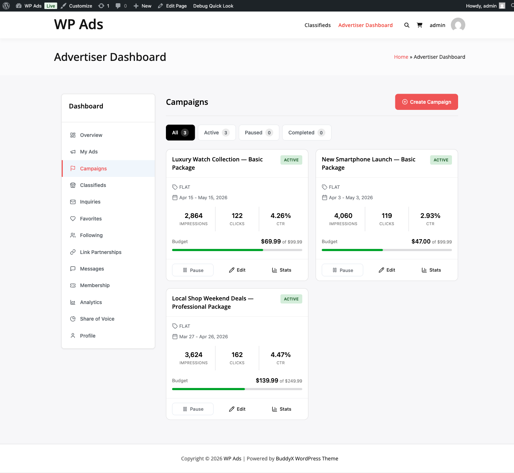

# Accept Paid Ads



> **PRO feature.** Requires the [WB Ad Manager Pro](https://wbcomdesigns.com/downloads/wb-ad-manager-pro/) add-on on top of the free plugin.

This flow takes you from a freshly-activated Pro plugin to the first advertiser who paid for an ad that is now live on your site, with the payment recorded in the wallet ledger. Budget about 45 minutes of active work, plus whatever time your test advertiser takes to complete their first purchase.

## Before you start

- The free plugin is installed and you have published at least one ad yourself — complete [Publish Your First Ad](publish-first-ad.md) if you have not.
- You have a valid Pro license key.
- You have one of these payment stacks already running on the site: **WooCommerce** (with at least one working gateway), **WooCommerce Subscriptions**, **WooCommerce Memberships**, **Paid Memberships Pro**, or **MemberPress**. Pro does not ship direct Stripe / PayPal / Razorpay integration; credit top-ups are collected by the source plugin of whichever adapter you enable.
- You have a second WordPress user you can log in as to play the advertiser role (or you can create one mid-flow).

## Step 1 — Activate Pro and accept the license

1. Upload and activate **WB Ad Manager Pro** from **Plugins → Add New → Upload Plugin**.
2. Go to **WB Ad Manager Pro → Settings → License**, paste your license key, click **Activate License**.
3. Confirm the license status shows as active. If it does not, automatic updates are off until you resolve it.

Full prerequisite detail lives in [Pro Installation & Requirements](../getting-started/pro-installation-requirements.md).

## Step 2 — Enable the modules you need

1. Go to **Pro Settings → Modules** (path: **WB Ad Manager → Pro Settings → Modules**).
2. Confirm these are on: **Wallet & Billing**, **Campaigns**, **Ad Packages**, **Ad Submissions**, **Email Notifications**.
3. Save.

Ad Submissions depends on Wallet + Campaigns + Packages; the UI enforces the dependency automatically. The Advertisers module is core and is always on.

The full module table is in [Pro Settings Configuration → Tab 2 Modules](../settings/pro-settings-configuration.md#tab-2-modules).

## Step 3 — Configure the credit top-up adapter

This is the step most installs get wrong. Pro does not collect money itself — it consumes credits granted by an **adapter** that plugs into a payment system you already run.

1. Open **Pro Settings → Credits**.
2. Enable the adapter whose source plugin is active on your site. For the most common case, that is **WooCommerce Products**.
3. For WooCommerce Products: in WooCommerce, create Simple Products such as `100 Credits – $10` and `500 Credits – $45`. Then back in **Pro Settings → Credits**, click **Add Mapping**, pick the product, and enter the credit amount each purchase should grant.
4. Set the currency and currency symbol to match what your payment source uses.
5. Set **Minimum Deposit** (default `$5.00`) and **Low Balance Threshold** (default `$10.00`).

For the full adapter walkthrough covering subscriptions, memberships, PMPro, and MemberPress, see [Wallet and Payments](../payments/wallet-and-payments.md) and [Pro Settings Configuration → Tab 3 Credits](../settings/pro-settings-configuration.md#tab-3-credits).

## Step 4 — Create at least one ad package

Packages are what advertisers actually purchase. Without at least one active package, the submission wizard has nothing to offer.

1. Go to **WB Ads → Packages → Add New**.
2. Name the package, pick a pricing model (`flat`, `cpm`, `cpc`, or `cpm_cpc`), set the price, duration, and any impression or click limit.
3. Under **Placements**, leave empty to allow all or pick specific placements the package covers.
4. Leave **Requires Approval** on for your first package so you can review submissions manually until you trust the flow.
5. Click **Save Package**. Confirm the package shows **Active** in the list.

Field reference: [Creating Ad Packages](../settings/creating-ad-packages.md). A fresh install seeds four example packages you can also edit instead of creating from scratch.

## Step 5 — Publish the advertiser dashboard page

1. Go to **Pages → Add New**.
2. Title it `Advertiser Dashboard`.
3. Paste in the shortcode:

   ```
   [wbam_advertiser_dashboard]
   ```
4. Publish.
5. Go to **Pro Settings → Pages** and confirm the Advertiser Dashboard page is mapped to the page you just created. If not, assign it and save.

The dashboard is the single frontend entry point — advertisers manage ads, classifieds, wallet, and analytics from here. See [Advertiser Portal Overview](../advertiser-portal/advertiser-portal-overview.md).

## Step 6 — Register (or approve) the test advertiser

In an incognito window, log in as your test user and visit the Advertiser Dashboard page.

- If you enabled **Auto-approve advertisers** in **Pro Settings → General**, the account is ready immediately.
- If not, the user sees a `pending` notice. Go back to your admin session, open **WB Ads → Advertisers**, click the user, and change their status to **Active**.

Status meanings are in [Advertiser Portal Overview → Account Statuses](../advertiser-portal/advertiser-portal-overview.md#account-statuses).

## Step 7 — Top up the advertiser's wallet

1. Still logged in as the test advertiser, open the **Wallet** tab on the dashboard.
2. Click **Buy Credits**. The button routes to the purchase URL you set in Step 3 (for the WooCommerce path, that is the shop page or a credit-packs category).
3. Complete the purchase through your existing gateway. This is a real purchase from the source plugin's point of view; use a test payment method if you have one (Stripe test mode, WooCommerce "Check payments" gateway, etc.).
4. Once the source order reaches `completed` or `processing`, the adapter grants credits immediately.
5. Confirm the Wallet tab now shows the new balance. A ledger entry of type `topup` is recorded.

The full adapter flow, all nine transaction types, and the offline / bank-transfer variant are documented in [Wallet and Payments](../payments/wallet-and-payments.md).

## Step 8 — Submit the first paid ad

Still as the test advertiser:

1. On the dashboard, open the **Ads** tab and click **Create New Ad**.
2. Walk the four-step wizard: Ad Type → Content → Package → Placements.
3. Pick the package you created in Step 4.
4. Submit.

What happens under the covers:

- The ad post is created as a draft.
- A campaign is created from the package via `Campaign_Manager::create_from_package()`.
- For a **flat-rate** package the price is debited from the wallet at this point.
- For a **CPM** or **CPC** package with a budget, the full budget is pre-charged as a `campaign_reserve` ledger entry.
- Because the package requires approval, the submission enters `pending` status and you get an email.

Full submission logic: [Ad Submissions and Approval Workflow](../advertiser-portal/ad-submissions-approval-workflow.md).

## Step 9 — Approve the submission

1. In your admin session, go to **WB Ads → Submissions**. The submission shows with a pending badge.
2. Open it, review the creative and placements, and click **Approve**.
3. The campaign activates. For CPM / CPC campaigns the approval can still fail at this moment if the wallet can no longer cover the reservation (e.g., the advertiser spent elsewhere in between) — if so, top up and retry.

## Step 10 — Confirm the ad serves on the frontend

1. In an incognito window, visit a page that matches the package's allowed placements.
2. Confirm the advertiser's creative renders.
3. Refresh a few times and confirm impression counts increment in **WB Ads → Campaigns**.

Impression and click counting uses row-level locking and per-day cookies — see [Campaign Management → Tracking Accuracy](../advertiser-portal/campaign-management.md#tracking-accuracy).

## Verification — how to confirm the full flow worked

All six must be true:

- The advertiser account shows status **Active** in **WB Ads → Advertisers**.
- The wallet balance on the Advertiser Dashboard matches what the advertiser paid minus the package cost (or, for CPM / CPC, minus the reserved budget).
- **WB Ads → Transactions** shows at least one `topup` ledger entry (from the adapter) and one `package` or `campaign_reserve` debit (from the submission).
- The submission shows **Approved** in **WB Ads → Submissions**.
- The campaign shows **Active** in **WB Ads → Campaigns**.
- The advertiser's creative renders on the frontend in a matching placement and impressions increment.

## What to do next

- Add a second package at a different price point so advertisers have a choice. Guidance in [Creating Ad Packages → Best Practices](../settings/creating-ad-packages.md#best-practices).
- Turn on the **Trust System** in **Pro Settings → General** to auto-approve paid submissions from advertisers with a clean history. Code/HTML ads still require manual review.
- Move on to the classifieds marketplace in [Launch a Classifieds Marketplace](launch-classifieds-marketplace.md).
- Work through [Pro Troubleshooting](../troubleshooting/pro-troubleshooting.md) if approvals, reservations, or top-ups behave unexpectedly.
