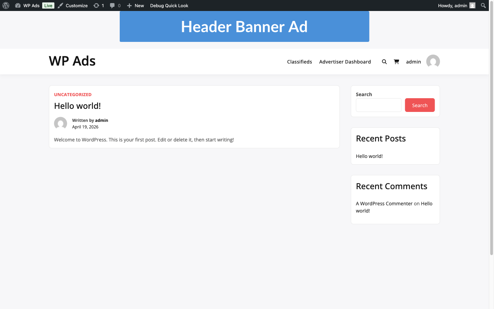

# Publish Your First Ad



This flow takes a freshly-installed free plugin to a live ad rendered on the frontend with its first impression counted. Budget about 10 minutes. Work top to bottom; each step tells you what you should see before you move on.

## Before you start

- The free plugin **WB Ad Manager** is installed and activated.
- You have WordPress admin access on the site you want to serve the ad on.
- You have one image (JPG / PNG / GIF / WebP) ready to use as the creative, and a destination URL.

## Step 1 — Confirm the admin area loaded

1. Go to **WB Ad Manager → Ads** in the admin sidebar.
2. You should see an empty list with an **Add New** button at the top.

If the menu is missing, the plugin is not active. Fix that before continuing — see [Installation](../getting-started/installation.md).

## Step 2 — Create the ad post

1. Click **Add New**.
2. Enter a title. This is internal-only; advertisers never see it.
3. In the **Ad Type** control, pick **Image**.
4. Upload the creative and enter the **Destination URL**.
5. Fill in **Alt text** for accessibility.

Do not publish yet. The next step decides where the ad appears.

## Step 3 — Pick a placement

1. Scroll to the **Placements** metabox.
2. Check **After Content**. This is the simplest placement to verify because it appears on every single post.
3. In the **Ad Status** metabox, leave **Priority** at the default and leave **Session Limit** empty.

## Step 4 — Publish

1. Click **Publish**.
2. The post moves to **Published** status and the **Ads** list now shows one row.

For the full field reference, see [Managing Ads](../ad-management/managing-ads.md).

## Step 5 — Render the ad on the frontend

You have two equally valid ways to display it. Pick one.

### Option A — automatic placement (zero code)

Because you checked **After Content** in Step 3, the ad renders automatically at the bottom of every single-post page.

1. Open any published post on the frontend in an incognito window (so admin-exclude filters do not hide it).
2. Scroll to the end of the post content.
3. Confirm your image appears above the comments area.

### Option B — shortcode placement (one specific page)

Use this when you want the ad on one page, or inside a theme template.

1. Edit the page where you want the ad.
2. Insert this shortcode where the ad should appear:

   ```
   [wbam_ad id="123"]
   ```

   Replace `123` with the ad post ID (visible in the row's URL in **WB Ad Manager → Ads**).
3. Update the page. Open it in an incognito window and confirm the ad renders.

The full shortcode reference is in [Ad Shortcodes](../shortcode-reference/ad-shortcodes.md).

## Step 6 — Confirm tracking fires

1. In the incognito window, click the ad image once. The destination URL opens.
2. Go back to **WB Ad Manager → Ads**.
3. In the row for this ad, the **Impressions** column should show at least 1 and **Clicks** should show at least 1.

If both columns are still zero after 30 seconds, check [Common Issues](../troubleshooting/common-issues.md) — the top two causes are caching plugins and the **Exclude Admins** setting counting your admin session out.

## Verification — how to confirm the full flow worked

All four must be true:

- The ad row in **WB Ad Manager → Ads** shows status **Published**.
- The ad renders on the frontend in the placement you chose (After Content or shortcode target).
- Clicking the ad opens the destination URL in the target you set.
- The **Impressions** and **Clicks** columns both increment within a minute of your test click.

## What to do next

- Add a second ad with the same placement. They rotate automatically based on priority. See [Managing Ads](../ad-management/managing-ads.md#ad-priority).
- Run an A/B test by creating two variants sharing a placement and using the comparison metabox.
- Schedule the ad to stop on a specific date — see [Targeting & Scheduling](../ad-management/targeting.md).
- Ready to sell ad space? Move on to [Accept Paid Ads](accept-paid-ads.md).
