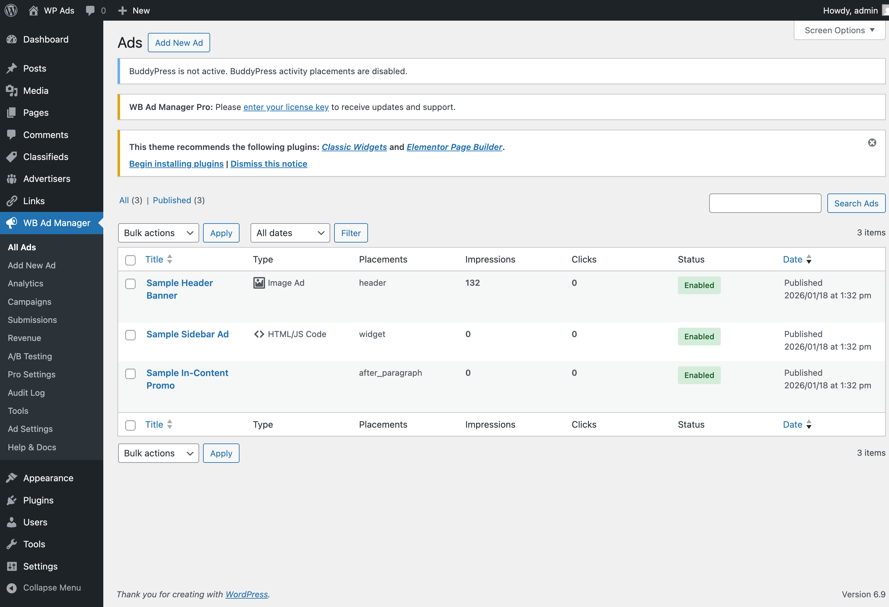

# Quick Setup Guide

## What You'll Learn

- How to create ads with placement checkboxes
- How to display ads on your site
- How to track performance

---

## Overview

Setting up WB Ad Manager involves two simple steps:

1. **Create Ads** - Add your ad content and choose where it appears
2. **Display Ads** - Use shortcodes for manual placement anywhere

Ads assigned to the same placement rotate automatically based on priority. No zones to create.

---

## Step 1: Create Your First Ad (5 minutes)


*The ads list showing all your ads with status, placements, and performance metrics*

### For Image Ads

1. Go to **WB Ad Manager → Ads**
2. Click **Add New**
3. Enter:
   - **Title**: "Summer Sale Banner" (internal only)
   - **Ad Type**: Image
4. Upload your banner image
5. Enter **Destination URL**: `https://example.com/sale`
6. In the **Placements** metabox, check where this ad should appear (e.g., "After Content", "Sidebar")
7. Set **Priority** (1–10) — higher priority shows the ad more often when multiple ads share a placement
8. Click **Publish**

### For HTML/Code Ads

1. Go to **WB Ad Manager → Ads → Add New**
2. Select **Ad Type**: Code/HTML/JS
3. Paste your HTML or JavaScript code
4. Check your desired placements and **Publish**

### For Google AdSense

1. Go to **WB Ad Manager → Ads → Add New**
2. Select **Ad Type**: AdSense
3. Enter your Ad Unit ID
4. Check your desired placements and **Publish**

> **Tip:** Add multiple ads and assign them to the same placement. They will rotate automatically, with higher priority ads appearing more often.

---

## Step 2: Display Ads on Your Site (2 minutes)

### Using Shortcodes (Manual Placement)

Use shortcodes to display a specific ad by ID anywhere — pages, posts, widgets, or theme templates:

```
[wbam_ad id="123"]
```

Display multiple specific ads at once:

```
[wbam_ads ids="1,2,3"]
```

**Where to add shortcodes:**

| Location | How to Add |
|----------|------------|
| Pages/Posts | Add directly in content editor |
| Widgets | Use Text/HTML widget in sidebar |
| Theme | Use `do_shortcode()` in PHP |

### Using Automatic Placements

Automatic placements insert ads without shortcodes. Check the placements you want directly on each ad:

- **Before Content** / **After Content**
- **Header** / **Footer**
- **Sidebar**
- **After Paragraph X** (and optionally repeat)
- And more

---

## Step 3: Verify It's Working (1 minute)

1. Visit a page where you added the shortcode or have an automatic placement active
2. Your ad should display
3. Click the ad to test tracking
4. Go to **WB Ad Manager → Ads**
5. Check the Impressions and Clicks columns

---

## Step 4: Configure Tracking (2 minutes)

### Enable Analytics

1. Go to **WB Ad Manager → Settings**
2. Verify tracking is enabled (it is by default)
3. Optionally enable **Exclude Admins** to keep your own visits out of stats

### View Reports

Stats appear directly in the Ads list: impressions and clicks per ad.

---

## Quick Reference

### Shortcodes Available

| Shortcode | Purpose |
|-----------|---------|
| `[wbam_ad id="123"]` | Display a single ad by ID |
| `[wbam_ads ids="1,2,3"]` | Display multiple specific ads |
| `[wbam_link id="123"]` | Display a managed tracked link |
| `[wbam_links]` | Display a link list |
| `[wbam_link_url id="123"]` | Output a raw tracked URL |
| `[wbam_partnership_inquiry]` | Link request form |

### Ad Statuses

| Status | Meaning |
|--------|---------|
| Published | Active and showing |
| Draft | Saved but not live |
| Scheduled | Will go live on start date |
| Disabled | Manually turned off in Ad Status metabox |

---

## Tips for Success

1. **Set priority** - Give important ads a higher priority (1–10) so they show more often
2. **Monitor performance** - Check impressions and clicks weekly
3. **Rotate creatives** - Add multiple ads to the same placement
4. **A/B test** - Create variations and compare performance using the built-in comparison metabox
5. **Use scheduling** - Set start and end dates for time-limited campaigns

---

## Common Questions

### How many ads can I create?

Unlimited. Create as many ads as you need.

### Can I schedule ads?

Yes. Set start and end dates when creating an ad.

### Does it slow down my site?

No. Lazy loading and query caching are enabled by default.

### Can I use Google AdSense?

Yes. Use the dedicated AdSense ad type, or paste AdSense code into a Code/HTML/JS ad.

---

## Next Steps

- [Create tracked links](../shortcode-reference/link-shortcodes.md)
- [Set up link partnerships](../link-management/link-management.md)
- [View all shortcode options](../shortcode-reference/ad-shortcodes.md)

---

## Upgrade to Pro

Ready for more? WB Ad Manager Pro includes:

- **Advertiser Portal** - Let others submit and pay for ads
- **Classifieds** - Run a marketplace
- **Wallet System** - Accept payments
- **Advanced Analytics** - Detailed reports

*WB Ad Manager Pro adds campaigns, wallet payments, classifieds marketplace, and advanced analytics.*

---

*Questions? Check our [Troubleshooting Guide](../troubleshooting/common-issues.md)*
