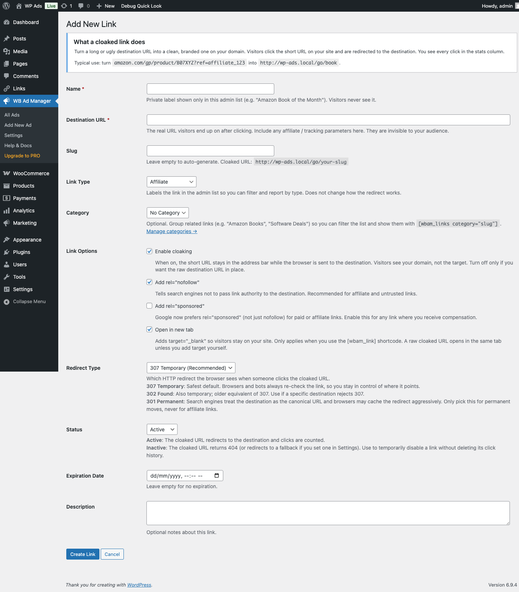
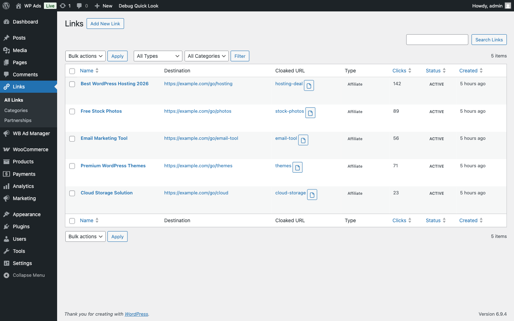

# Link Management - Site Owner Guide

## What You'll Learn

- How to create and track outbound links
- How to set up link partnerships
- How to organize and display links
- SEO best practices for link management

---

## Why Use Link Management?

Instead of pasting raw URLs throughout your site, managed links offer:

- **Click tracking** - Know how many people click each link
- **Easy updates** - Change URL in one place, updates everywhere
- **SEO control** - Set nofollow, sponsored attributes
- **Organization** - Categorize and manage all links
- **Partnerships** - Accept link partnership requests

---

## Creating Managed Links


*The Add New Link form showing URL configuration, cloaking options, and SEO attributes*

### Step-by-Step

1. Go to **WB Ad Manager → Links**
2. Click **Add New**
3. Enter link details:
   - **Title**: Display name (shown to users)
   - **URL**: Destination address
   - **Description**: Optional text about the link
4. Configure options:
   - **Category**: For organization
   - **Target**: New window or same
   - **Nofollow**: SEO setting
5. Click **Publish**

### Link Fields Explained

| Field | Purpose | Example |
|-------|---------|---------|
| **Title** | Anchor text | "Best WordPress Themes" |
| **URL** | Destination | `https://example.com` |
| **Description** | Extra info | "Our recommended theme provider" |
| **Category** | Organization | "Partners", "Resources" |

---

## Link Categories

Organize links into categories for easy management and display.

### Creating Categories

1. Go to **WB Ad Manager → Links → Categories**
2. Enter category name
3. Add slug (URL-friendly version)
4. Add description (optional)
5. Click **Add New Category**

### Suggested Categories

| Category | Use For |
|----------|---------|
| `sponsors` | Paid sponsor links |
| `partners` | Business partners |
| `resources` | Helpful external resources |
| `affiliates` | Affiliate links |
| `tools` | Tools you recommend |

---

## Displaying Links

### Single Link

```
[wbam_link id="123"]
```

With custom text:
```
[wbam_link id="123" text="Click here to learn more"]
```

### Link List

Show all links from a category:
```
[wbam_links category="1"]
```

> **Note:** The `category` parameter requires a numeric category ID, not a slug. Find the ID in **WB Ad Manager → Links → Categories** (hover the category name to see the ID in the URL).

Grid layout:
```
[wbam_links category="1" format="grid"]
```

### Just the URL

For use in custom HTML:
```
[wbam_link_url id="123"]
```

Example in custom button:
```html
<a href="[wbam_link_url id='123']" class="my-button">
    Visit Partner
</a>
```

---

## Link Partnerships

Allow visitors to request link placements on your site.

### Setting Up Partnership Form

1. Create a new page (e.g., "Become a Partner")
2. Add the shortcode:
```
[wbam_partnership_inquiry]
```
3. Publish the page
4. Add page link to your navigation

### Customizing the Form

```
[wbam_partnership_inquiry
    title="Request Link Partnership"
    description="Thanks for your interest! We'll review your request within 48 hours."
]
```

### Managing Partnership Requests


*The Partnership Inquiries page with status filters, search, and inquiry management*

1. Go to **WB Ad Manager → Partnerships**
2. View pending requests
3. Review details:
   - Requester info
   - Proposed website
   - Requested anchor text
4. Approve or reject
5. If approved, link is created automatically

### Partnership Workflow

```
Guest submits form → Admin receives notification →
Admin reviews request → Approve/Reject →
If approved: Link created → Guest notified
```

---

## Tracking Link Performance


*The Link Analytics dashboard showing click trends, link types distribution, and top performers*

### Viewing Click Data

1. Go to **WB Ad Manager → Links**
2. See click counts in the list view
3. Click individual link for details

### Metrics Available

| Metric | Description |
|--------|-------------|
| **Total Clicks** | All-time clicks |
| **Unique Clicks** | Deduplicated visitors |
| **Referrers** | Pages where link was clicked |
| **Dates** | When clicks occurred |

---

## SEO Settings

### Nofollow Links

When to use nofollow:
- Paid/sponsored links
- Affiliate links
- User-submitted links
- Links you can't vouch for

Setting nofollow:
1. Edit the link
2. Check "Nofollow" option
3. Save

Or via shortcode:
```
[wbam_link id="123" nofollow="true"]
```

### Rel Attributes

| Attribute | Use Case |
|-----------|----------|
| `nofollow` | Don't pass link equity |
| `sponsored` | Paid/sponsored links |
| `ugc` | User-generated content |

Setting in shortcode:
```
[wbam_link id="123" sponsored="true"]
```

---

## Common Use Cases

### Sponsor Section

```html
<section class="sponsors">
    <h2>Our Sponsors</h2>
    [wbam_links category="1" format="grid"]
</section>
```

### Resources Page

```html
<h1>Helpful Resources</h1>
<p>Tools and services we recommend:</p>

<h2>Development Tools</h2>
[wbam_links category="2" format="list"]

<h2>Design Resources</h2>
[wbam_links category="3" format="list"]
```

### Footer Partners

```html
<div class="footer-partners">
    <span>Partners:</span>
    [wbam_links category="1" limit="5" format="inline"]
</div>
```

### Call-to-Action Button

```html
<div class="cta-box">
    <h3>Get Started Today</h3>
    <p>Try our recommended hosting provider.</p>
    <a href="[wbam_link_url id='45']" class="button">
        Sign Up Now
    </a>
</div>
```

---

## Best Practices

### Link Management

1. **Use descriptive titles** - Clear, helpful anchor text
2. **Categorize everything** - Makes display and management easier
3. **Review regularly** - Remove broken or outdated links
4. **Track performance** - Focus on high-performers

### SEO

1. **Mark paid links** - Use nofollow/sponsored
2. **Balance link types** - Mix follow and nofollow
3. **Avoid excessive links** - Quality over quantity
4. **Check destinations** - Ensure links work

### Partnerships

1. **Set clear criteria** - Define what you accept
2. **Respond promptly** - Good for relationships
3. **Verify sites** - Check partner quality
4. **Document terms** - Clear expectations

---

## Bulk Operations

### Finding Links

Use filters in **WB Ad Manager → Links**:
- Filter by category
- Filter by status
- Search by title

### Bulk Actions

1. Check multiple links
2. Select action:
   - Delete
   - Move to category
   - Change status
3. Apply

---

## Troubleshooting

### Links not tracking

- Check tracking is enabled in settings
- Verify link is published
- Test in incognito (ad blockers)
- Clear caching

### Partnership form issues

- Check WordPress email is working
- Verify form fields are valid
- Check for JavaScript errors
- Test admin notification email

### Link showing wrong text

- Check shortcode `text` parameter
- Verify link title is set
- Clear any caching

---

## Next Steps

- [View shortcode reference](../shortcode-reference/link-shortcodes.md)
- [Ad management guide](../ad-management/managing-ads.md)
- [Troubleshooting](../troubleshooting/common-issues.md)

---

*Want more link features? WB Ad Manager Pro adds auto-linking, link injection, and advanced analytics.*
