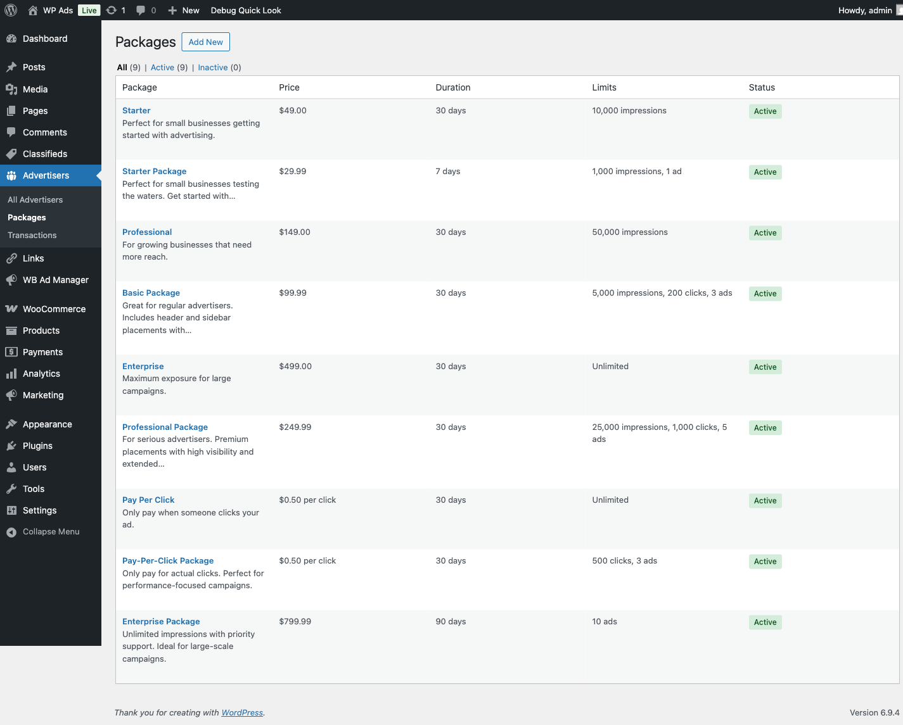

# Creating Ad Packages

> **PRO feature.** Requires the [WB Ad Manager Pro](https://wbcomdesigns.com/downloads/wb-ad-manager-pro/) add-on on top of the free plugin.

Ad packages define what advertisers purchase: pricing model, duration, impression or click limits, and which placements are included. When an advertiser submits an ad, they select a package, pay for it, and a campaign is created automatically.

---

## How Packages Connect to Campaigns

When an advertiser purchases a package and their ad is approved, the plugin calls `Campaign_Manager::create_from_package()`. This creates a campaign linked to the package and the ad.

**Budget reservation for CPM and CPC packages:**

When the campaign status changes to `active`, the system pre-funds a budget reservation from the advertiser's wallet. This reservation holds the funds until the campaign completes or is cancelled, at which point unused funds are refunded automatically.

- **Flat rate packages** — the package price is deducted at purchase time. No ongoing reservation.
- **CPM packages** — the campaign budget is reserved at activation. The wallet is debited in real time as impressions accumulate. Unused budget is refunded when the campaign ends.
- **CPC packages** — same reservation behaviour as CPM, debited per click instead of per impression.

If an advertiser's wallet balance is insufficient to cover the reservation, the campaign stays in `pending` status and cannot activate until funds are added.

**Important:** Pausing a campaign does not release the budget reservation. Funds remain held and are not re-reserved when the campaign resumes.

---

## Pricing Models

| Model | Key | How Cost Is Calculated |
|-------|-----|------------------------|
| Flat Rate | `flat` | Fixed `price` charged at purchase |
| Cost Per 1,000 Impressions | `cpm` | `(impressions × price_per_unit) / 1000` |
| Cost Per Click | `cpc` | `clicks × price_per_unit` |
| CPM + CPC Combined | `cpm_cpc` | CPM cost + CPC cost summed |

---

## Package Fields

| Field | Type | Default | Description |
|-------|------|---------|-------------|
| Name | string | — | Package display name shown to advertisers |
| Description | text | — | What's included; supports basic HTML |
| Status | select | `active` | `active`, `inactive`, or `archived` |
| Pricing Model | select | `flat` | See table above |
| Price | decimal | `0.00` | Used for `flat` pricing model |
| Price Per Unit | decimal | `0.00` | Rate per 1,000 impressions (CPM) or per click (CPC) |
| Duration (days) | integer | `30` | How many days the campaign runs. Set to `0` for unlimited |
| Impressions Limit | integer | null | Maximum impressions before the campaign pauses. Leave blank for unlimited |
| Clicks Limit | integer | null | Maximum clicks before the campaign pauses. Leave blank for unlimited |
| Placements | multi-select | (all) | Which ad placements this package covers. Leave empty for all placements |
| Requires Approval | checkbox | `true` | Whether purchased ads need admin review before going live |
| Max Ads Per Advertiser | integer | null | Limit how many active campaigns an advertiser can have with this package. Leave blank for unlimited |
| Sort Order | integer | `0` | Display order in package selection lists |

---

## Creating a Package

1. Go to **WB Ads → Packages → Add New**.
2. Enter a **Name** and **Description**.
3. Choose a **Pricing Model**.
   - For `flat`: enter the **Price**.
   - For `cpm` or `cpc`: enter the **Price Per Unit**.
4. Set **Duration (days)** and optional **Impressions Limit** or **Clicks Limit**.
5. Select **Placements** (leave empty to allow all).
6. Set **Requires Approval** and **Max Ads Per Advertiser** as needed.
7. Click **Save Package**.

---

## Default Packages

On a fresh installation the plugin creates four example packages if no packages exist:

| Package | Model | Price | Duration | Impressions |
|---------|-------|-------|----------|-------------|
| Starter | Flat | $49.00 | 30 days | 10,000 |
| Professional | Flat | $149.00 | 30 days | 50,000 |
| Enterprise | Flat | $499.00 | 30 days | Unlimited |
| Pay Per Click | CPC | $0.50/click | 30 days | Unlimited |

Enterprise packages have `requires_approval` set to `false` by default.

---

## Managing Packages

- **Duplicate** — Creates a copy with `(Copy)` appended to the name and status set to `inactive`. Use this to create new tiers based on an existing package.
- **Reorder** — Drag packages into the desired display order.
- **Archive** — Hides a package from advertisers without deleting historical campaign data.

---

## Package Statuses

| Status | Visible to Advertisers | Description |
|--------|------------------------|-------------|
| `active` | Yes | Available for purchase |
| `inactive` | No | Hidden from frontend |
| `archived` | No | Permanently retired; keeps historical data |

---

## Best Practices

- **3–4 tiers** work best (Starter / Pro / Enterprise or similar good-better-best pricing).
- Make the **middle tier the best value** to drive upgrades.
- For CPM/CPC packages, ensure advertisers understand they need **sufficient wallet balance** at the time of campaign activation.
- Set `requires_approval = false` only for premium tiers or trusted advertisers to reduce admin workload.
- Use `max_ads` to prevent a single advertiser from monopolising inventory on popular packages.
