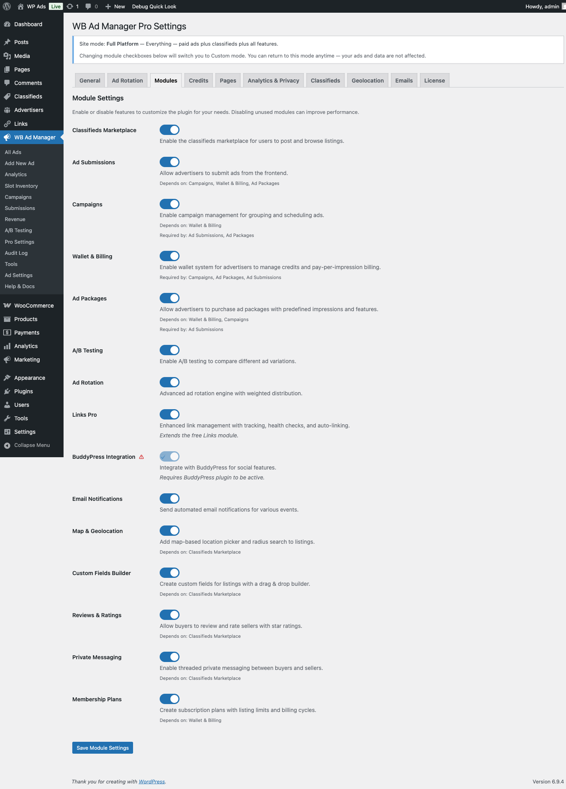
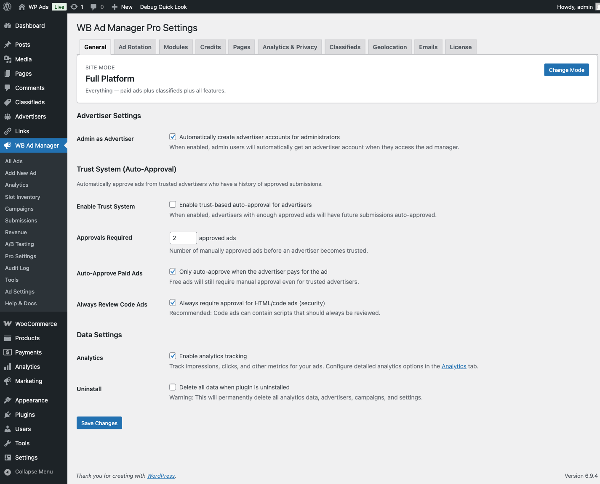
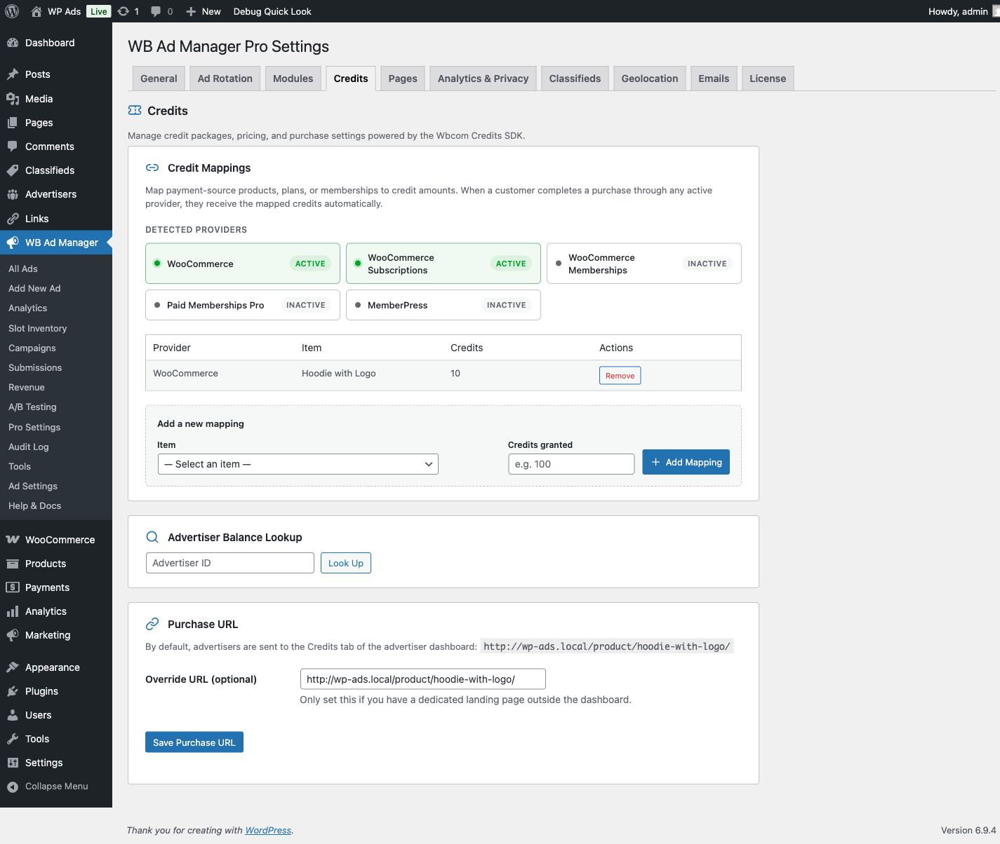
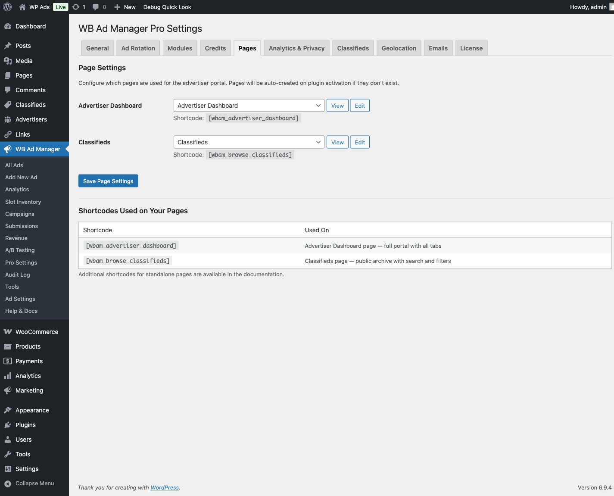
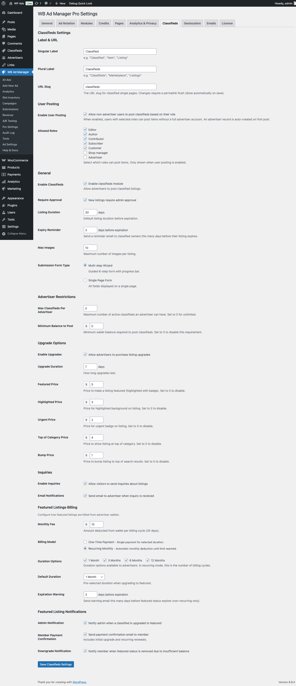
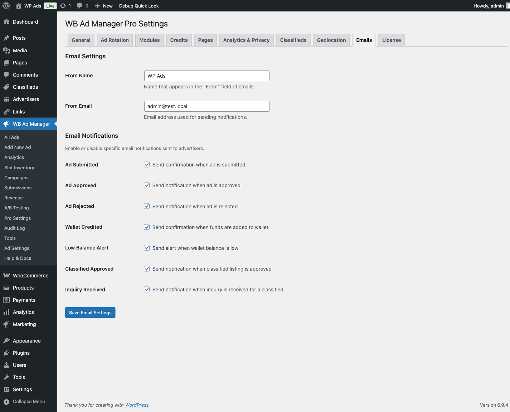

# Pro Settings Configuration

> **PRO feature.** Requires the [WB Ad Manager Pro](https://wbcomdesigns.com/downloads/wb-ad-manager-pro/) add-on on top of the free plugin.

Configure WB Ad Manager Pro via **WB Ads → Pro Settings** (or navigate to **Ads → Pro Settings** in your admin menu). Settings are split across seven tabs.

---

## Tab 1: General

Navigate to: **Pro Settings → General**

### Advertiser Settings

| Setting | Default | Description |
|---------|---------|-------------|
| Admin as Advertiser | Off | Automatically create an advertiser account for admin users when they access the ad manager |
| Auto-Approve Advertisers | Off | Automatically approve new advertiser registrations without manual review |

### Trust System (Auto-Approval)

Automatically approve ads from advertisers who have a track record of approved submissions.

| Setting | Default | Description |
|---------|---------|-------------|
| Enable Trust System | Off | Enables trust-based auto-approval for qualified advertisers |
| Approvals Required | 2 | How many manually approved ads an advertiser needs before becoming trusted |
| Auto-Approve Paid Ads | On | Only auto-approve ads that were paid for; free ads still require manual review |
| Always Review Code Ads | On | HTML/code ads always require manual approval regardless of trust status (recommended for security) |

### Data Settings

| Setting | Default | Description |
|---------|---------|-------------|
| Analytics | Off | Enable impression and click tracking across all ads |
| Delete Data on Uninstall | Off | Permanently delete all analytics data, advertisers, campaigns, and settings when the plugin is uninstalled |

---

## Tab 2: Modules

Navigate to: **Pro Settings → Modules**

Enable or disable Pro feature modules. Disabling a module hides it from all admin menus and frontend shortcodes. Module dependencies are enforced automatically — if you disable a required module, dependent modules disable too.

The Advertisers module is core and always active; it does not appear in this toggle list and cannot be disabled.

| Module | Default | Depends On | Description |
|--------|---------|------------|-------------|
| Classifieds Marketplace | On | Wallet | Lets users post and browse classified ads |
| Ad Submissions | On | Wallet, Campaigns, Packages | Frontend ad submission form for advertisers |
| Campaigns | On | Wallet | Campaign management for grouping and scheduling ads |
| Wallet & Billing | On | — | Advertiser credit wallet and pay-per-impression billing |
| Ad Packages | On | Wallet, Campaigns | Purchasable ad packages with predefined limits |
| A/B Testing | On | — | Compare ad variations |
| Ad Rotation | On | — | Weighted ad rotation engine |
| Links Pro | On | — | Enhanced link tracking, health checks, and keyword auto-linking |
| BuddyPress Integration | On | — | Social features via BuddyPress (requires BuddyPress active) |
| Email Notifications | On | — | Automated emails for all platform events |

**Dependency map:**
- Campaigns requires Wallet
- Packages requires Wallet + Campaigns
- Ad Submissions requires Wallet + Campaigns + Packages
- Classifieds requires Wallet

---

## Tab 3: Credits

Navigate to: **Pro Settings → Credits**

Pro uses the **Wbcom Credits SDK** to accept credit top-ups rather than shipping its own payment-gateway integrations. Every adapter whose source plugin is active on the site auto-appears in this tab; you enable the adapters you want to use and map each one's products / levels to a credit amount.

### Available adapters

| Adapter | Appears when this plugin is active | Typical purchase UX |
|---------|-----------------------------------|---------------------|
| WooCommerce Products | WooCommerce | Advertiser buys a "Credit Pack" Simple Product at your WC checkout |
| WooCommerce Subscriptions | WooCommerce Subscriptions | Advertiser subscribes, renewal tops up credits automatically |
| WooCommerce Memberships | WooCommerce Memberships | Credits bundled into membership activation + renewal |
| Paid Memberships Pro | PMPro | Credits granted when the advertiser joins a PMPro level |
| MemberPress | MemberPress | Credits granted on MemberPress product purchase |

Each adapter delegates payment collection to its source plugin, so you configure Stripe, PayPal, Razorpay, or any other gateway in that plugin — not in Pro.

### Configuring an adapter mapping

1. Enable the adapter checkbox next to the one you want to use.
2. Click **Add Mapping**. A dropdown lists the products / levels from that plugin.
3. Pick the product, enter the credit amount the advertiser should receive, save.
4. Repeat for each credit pack or tier.

The active mappings table below shows every mapping you've created across adapters. You can delete or edit each row in place.

### Wallet settings

| Setting | Default | Description |
|---------|---------|-------------|
| Currency | USD | Currency code used for all wallet balances and transactions |
| Currency Symbol | $ | Symbol displayed with amounts (e.g., `$`, `€`, `£`) |
| Minimum Deposit | $5.00 | Minimum single top-up amount (filterable via `wbam_pro_minimum_deposit`) |
| Low Balance Threshold | $10.00 | Send a notification when an advertiser's balance falls below this amount (0 to disable) |
| Billing Threshold | $0.01 | Minimum unbilled amount before deducting from the wallet for CPM/CPC campaigns |

### Offline / bank-transfer top-ups

Enable the "Manual / Bank Transfer" option to let advertisers request a top-up against an offline payment. The advertiser enters a reference note; you approve or cancel the request from **WB Ads → Transactions → Pending Approval** once funds clear. Approvals fire the `wbam_fund_request_approved` action and email the advertiser.

See [Wallet and Payments](../payments/wallet-and-payments.md) for the full end-to-end walkthrough of each adapter path.

---

## Tab 4: Pages

Navigate to: **Pro Settings → Pages**

Map WordPress pages to plugin features. The plugin creates these pages automatically on activation. You can reassign them to any published, draft, or private page.

| Page Key | Default Slug | Default Shortcode |
|----------|--------------|-------------------|
| Advertiser Dashboard | `/advertiser-dashboard` | `[wbam_advertiser_dashboard]` |
| Classifieds | `/classifieds` | `[wbam_browse_classifieds]` |
| My Classifieds | `/my-classifieds` | `[wbam_my_classifieds]` |
| My Favorites | `/my-favorites` | `[wbam_my_favorites]` |
| Following | `/my-following` | `[wbam_my_following]` |

Each page row shows a **Visit** link to preview the current page and a **Create** button to generate a new page with the correct shortcode automatically inserted.

Settings are saved as individual `wbam_page_{key}` options (e.g., `wbam_page_advertiser_dashboard`) for fast lookup.

---

## Tab 5: Analytics & Privacy

Navigate to: **Pro Settings → Analytics & Privacy**

This tab is always visible. Analytics-specific settings only appear when analytics is enabled in the General tab.

### Analytics Settings

*(Visible only when analytics is enabled)*

| Setting | Default | Description |
|---------|---------|-------------|
| Pixel Tracking | Off | Use tracking pixels/beacons for more accurate viewability tracking |
| Track Logged-in Users | Off | Include logged-in users in analytics; by default only anonymous visitors are tracked |
| Bot Filtering | Off | Exclude known bots and crawlers. The tracker rejects requests whose User-Agent matches any of 40 substrings, including Googlebot, Bingbot, Yandexbot, Ahrefsbot, SEMrushbot, and headless-browser signatures (Puppeteer, Selenium, PhantomJS). See [Analytics Dashboard](../analytics/analytics-dashboard.md#bot-filtering) for the full list |
| Data Retention | 365 days | Raw event data older than this is deleted. Range: 30–3,650 days. Aggregated daily stats are kept permanently |
| Aggregate After | 7 days | After this many days, raw events are rolled up into daily summary stats. Range: 1–30 days |

### GDPR & Privacy Settings

These settings apply regardless of whether analytics is enabled.

| Setting | Default | Description |
|---------|---------|-------------|
| Require Cookie Consent | Off | Only track when the visitor has accepted cookies. Integrates with CookieYes, Complianz, Moove GDPR, and Cookie Notice |
| Anonymize IP Addresses | Off | Hash IP addresses with a salt that rotates at UTC midnight (new salt per UTC calendar day), strip user IDs, and remove sensitive query parameters from tracked URLs |

---

## Tab 6: Classifieds

Navigate to: **Pro Settings → Classifieds**

*(Only visible when the Classifieds module is enabled)*

### Classifieds Settings

| Setting | Default | Description |
|---------|---------|-------------|
| Enable Classifieds | On | Master switch for the classifieds marketplace |
| Require Approval | — | New listings require admin approval before going live |
| Listing Duration | 30 days | Default expiration period for new listings |
| Max Images | 10 | Maximum images per listing (up to 50) |

### Advertiser Restrictions

| Setting | Default | Description |
|---------|---------|-------------|
| Max Classifieds Per Advertiser | 0 (unlimited) | Cap how many active listings an advertiser can have at once |
| Minimum Balance to Post | $0.00 | Require a minimum wallet balance before posting is allowed (0 to disable) |

### Upgrade Options

Allow advertisers to pay to promote their listings.

| Setting | Default | Description |
|---------|---------|-------------|
| Enable Upgrades | — | Allow advertisers to purchase listing upgrades |
| Upgrade Duration | 7 days | How long each upgrade remains active |
| Featured Price | $5.00 / 30 days | Price to feature a listing (highlighted with badge). Set to 0 to disable |
| Highlighted Price | $3.00 / 7 days | Price for a coloured background highlight. Set to 0 to disable |
| Urgent Price | $4.00 / 7 days | Price for an urgent badge. Set to 0 to disable |
| Top of Category Price | $10.00 / 30 days | Price to pin a listing at the top of its category. Set to 0 to disable |
| Bump Price | $2.00 / 7 days | Price to bump a listing to the top of search results. Set to 0 to disable |

### Inquiries

| Setting | Default | Description |
|---------|---------|-------------|
| Enable Inquiries | — | Allow site visitors to send inquiries about listings |
| Email Notifications | — | Email the advertiser when an inquiry is received |

### Featured Listings Billing

Configure how the wallet is charged for featured listings.

| Setting | Default | Description |
|---------|---------|-------------|
| Monthly Fee | $10.00 | Amount deducted per billing cycle (30 days) |
| Billing Model | Recurring Monthly | **One-Time Payment** — single charge for selected duration. **Recurring Monthly** — automatic monthly deduction |
| Duration Options | 1, 3, 6, 12 months | Which duration options advertisers can choose from |

---

## Tab 7: Emails

Navigate to: **Pro Settings → Emails**

Configure automated email notifications. This tab is managed by the Email Notifications module. If that module is disabled, the tab is still visible but inactive.

Common email events configured here include: advertiser registration, ad approved/rejected, campaign status changes, low wallet balance alerts, classified listing approved/expired, inquiry received, and payment confirmation.

---

## Settings Storage

| Option Name | Contents |
|-------------|----------|
| `wbam_pro_settings` | General, Trust System, Analytics enable/disable, Currency, Wallet, GDPR flags |
| `wbam_pro_stripe_settings` | All Stripe keys, webhook secret, min/max amounts |
| `wbam_pro_classifieds_settings` | Classifieds module settings, upgrade prices |
| `wbam_pro_email_settings` | Email notification settings |
| `wbam_pro_analytics_settings` | Data retention, aggregation, report range |
| `wbam_page_{key}` | Individual page ID per portal page |
